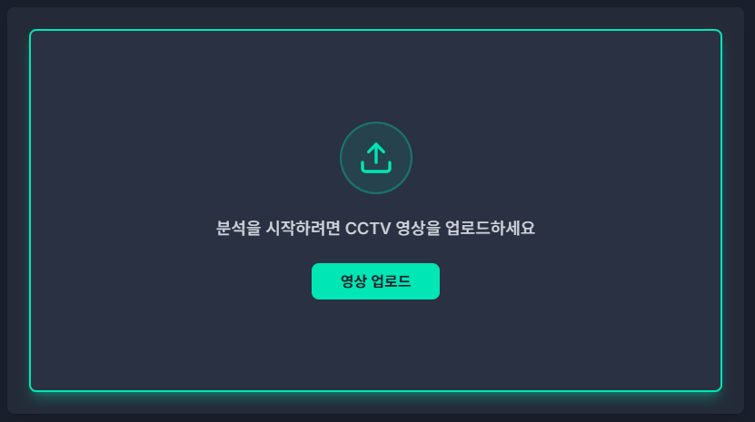
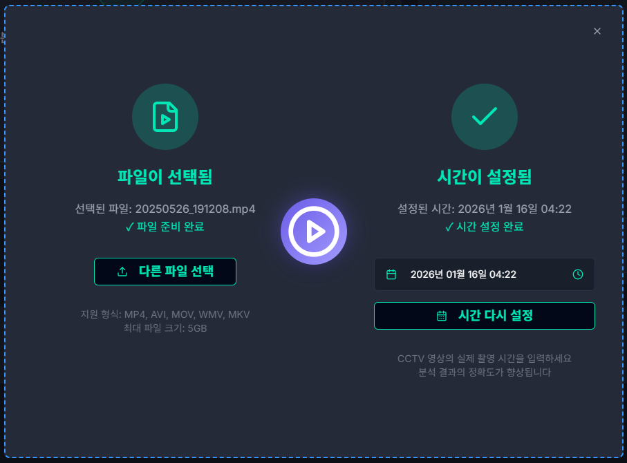
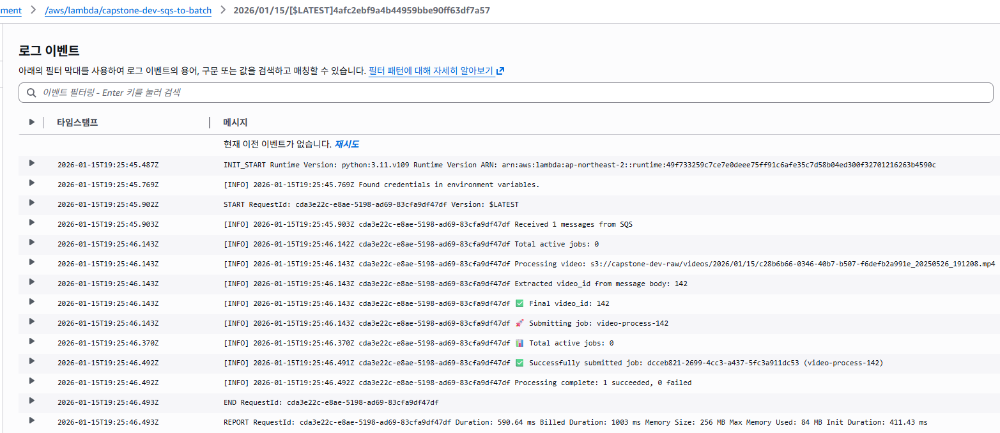
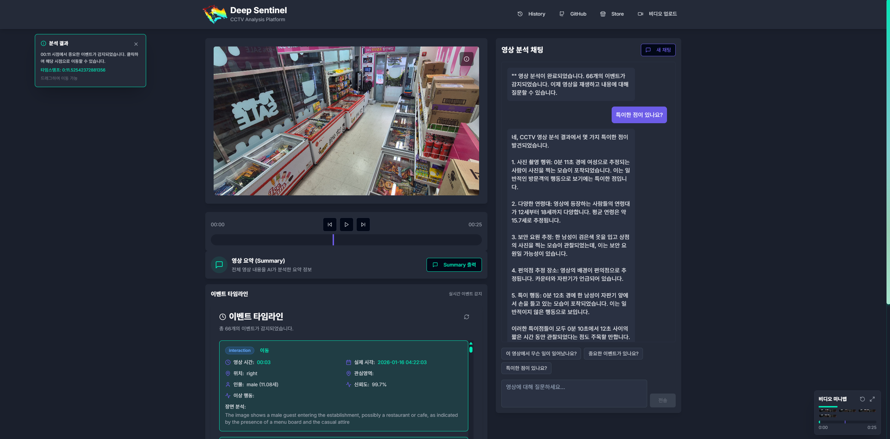

# 📸 DeepSentinel Service Flow

Visual demonstration of the complete service workflow and AI-powered video analysis pipeline.

## 1. Service Landing & Upload

|                    Main Dashboard                     |                 Video Upload                 |
| :---------------------------------------------------: | :------------------------------------------: |
|  |  |
|     **Real-time performance metrics monitoring**      |         **Start CCTV video upload**          |

## 2. Video Analysis Setup

|                      File Selection                       |                Analysis Start                |
| :-------------------------------------------------------: | :------------------------------------------: |
|  |  |
|        **Configure video file and analysis date**         |      **Trigger AWS Batch analysis job**      |

## 3. Backend Pipeline (Serverless)

|               SQS → Batch Trigger                |                         Analysis Progress                         |
| :----------------------------------------------: | :---------------------------------------------------------------: |
|  |  |
|  **Lambda transforms SQS message to Batch Job**  |             **Real-time analysis progress tracking**              |

## 4. AI Chat & RAG

**▲ AI-powered Q&A using AWS Bedrock Claude (Vector Search + LLM)**

## 5. Session Management

|                          Uploaded Videos                          |                         Session List                          |                         Session Detail                         |
| :---------------------------------------------------------------: | :-----------------------------------------------------------: | :------------------------------------------------------------: |
|  |  |  |
|                    **List of analyzed videos**                    |              **Conversation sessions per video**              |                **Timeline + Chatbot interface**                |
