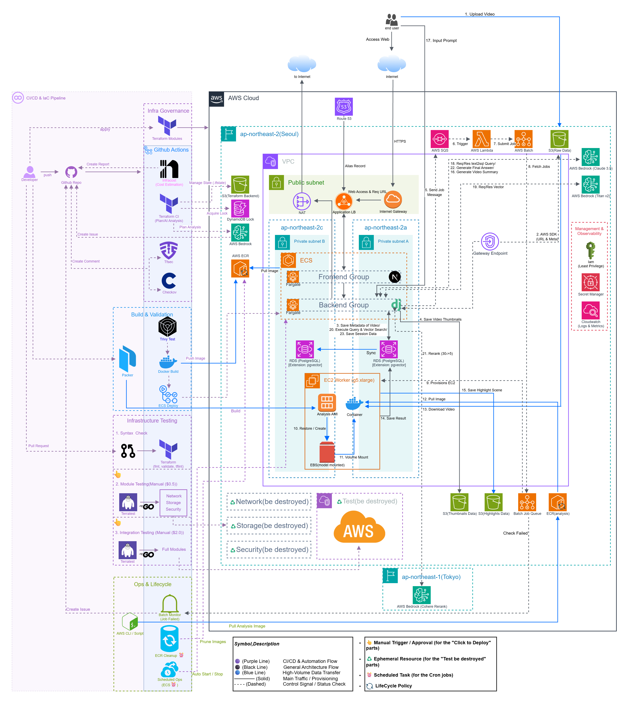

# 🦅 DeepSentinel

**AI-powered CCTV Video Analysis Platform for Unmanned Stores**

> **"Replace expensive sensors with AI - Secure unmanned stores using existing CCTV infrastructure."**

<div align="center">
  
</div>

---

## 📖 Introduction

### 🚨 Problem Statement

As unmanned stores and convenience shops proliferate, **theft, vandalism, and juvenile delinquency** have become serious social issues. However, for small business owners, deploying **expensive security sensors or specialized CCTV systems** creates significant financial burden.

### 💡 Our Solution

**DeepSentinel** is a **low-cost, high-efficiency security solution** that leverages existing CCTV footage with AI-powered anomaly detection and analysis - **no hardware replacement required**.

- **Cost-Effective**: Utilize existing IP cameras
- **Automated Monitoring**: 24/7 AI surveillance with automatic event tagging (theft, fights, vandalism, etc.)
- **Intelligent Search**: RAG-based chatbot lets you ask "What just happened?" in natural language

---

## 🎯 Key Features

✅ **Multi-AI Model Pipeline**: YOLO v8x + MiVOLO + MEBOW + LLaVA + AWS Bedrock Claude  
✅ **Serverless Architecture**: Auto-scaling GPU compute from 0 to 4 instances  
✅ **Cost Optimized**: $1-3 per video analysis vs $720/month for 24/7 GPU server  
✅ **Vector Search**: pgvector-powered semantic search for intelligent event retrieval  
✅ **Real-time Monitoring**: Live analysis progress tracking and event timeline visualization  
✅ **IaC Managed**: 153 AWS resources managed via Terraform with zero-downtime deployment  
✅ **FinOps Automation**: Automated cost estimation via Infracost on every PR  
✅ **Performance Validated**: 99.93% success rate with 50 concurrent users (p95 < 500ms)  
✅ **DevSecOps Pipeline**: Trivy security scanning + AI-powered failure analysis

---

## 📸 Service Demo

See how the service works in action: **[Service Flow Demo →](FLOW.md)**

|                         **Main Dashboard**                          |                          **AI Analysis Timeline**                          |
| :-----------------------------------------------------------------: | :------------------------------------------------------------------------: |
|  |  |
|              Real-time performance metrics monitoring               |               Object detection visualization & RAG-based Q&A               |

**Infrastructure Visualization**: See [Infrastructure Architecture →](INFRA.md)

---

## 🛠️ Architecture

DeepSentinel combines **automated CI/CD & IaC Pipeline** with **AWS Cloud Infrastructure** to create a fully automated, cost-optimized platform. Based on GitOps principles, we integrate FinOps, DevSecOps, and Infrastructure Testing into our deployment pipeline.

<div align="center">
  
</div>

**📖 [Complete Architecture Documentation →](docs/ARCHITECTURE_NEW.md)** (CI/CD Pipeline + Infrastructure Details)

### System Overview

Users upload videos through the frontend, which triggers the serverless GPU pipeline for AI analysis.

```
┌─────────────────────────────────────────────────────────────────────┐
│                          User (Browser)                             │
└─────────────────────────────────────────────────────────────────────┘
                              ↓ HTTPS
┌─────────────────────────────────────────────────────────────────────┐
│  Route53 + CloudFront + ALB                                         │
│  - deepsentinel.cloud                                               │
│  - SSL/TLS Termination                                              │
└─────────────────────────────────────────────────────────────────────┘
                              ↓
┌──────────────────────────────┬──────────────────────────────────────┐
│  Frontend (Next.js 15)       │  Backend (Django 5.2)                │
│  - ECS Fargate               │  - ECS Fargate                       │
│  - TypeScript + React 19     │  - REST API + pgvector RAG           │
└──────────────────────────────┴──────────────────────────────────────┘
                              ↓
┌─────────────────────────────────────────────────────────────────────┐
│                   Serverless AI Pipeline                            │
│                                                                     │
│  S3 Upload → SQS Event → Lambda Trigger → AWS Batch (GPU)          │
│                                              ↓                      │
│                                      g5.xlarge (A10G)               │
│                                      YOLOv8 + MiVOLO                │
│                                      + MEBOW + LLaVA                │
│                                              ↓                      │
│                                      PostgreSQL + pgvector          │
└─────────────────────────────────────────────────────────────────────┘
```

**Detailed Architecture**: See [INFRA.md](INFRA.md) for Terraform module breakdown and full infrastructure diagram.

---

## 🧰 Tech Stack

| Category                | Technologies                                                                                                                                                                                                                                                                                                                                                                                                                                                                                                                                                                                                  |
| ----------------------- | ------------------------------------------------------------------------------------------------------------------------------------------------------------------------------------------------------------------------------------------------------------------------------------------------------------------------------------------------------------------------------------------------------------------------------------------------------------------------------------------------------------------------------------------------------------------------------------------------------------- |
| **Infrastructure**      |                                                                                                                               |
| **Backend**             |                                                                                                                                                                                                   |
| **Frontend**            |                                                                                                                                                                                         |
| **AI / ML**             |                                                                                                                                                                                                                                       |
| **DevOps**              |       |
| **DevSecOps & Testing** |                                                                                                                                       |
| **CI/CD & FinOps**      |                                                                                                                                                                                                                                                                                                    |

---

## 🚀 Quick Start

### Prerequisites

- Docker & Docker Compose
- AWS Account with configured credentials
- Node.js 18+ (for local development)
- Python 3.10+ (for local development)

### Local Development with Docker Compose

For production deployment with existing infrastructure:

```bash
# Clone the repository (requires access)
git clone [private-repo-url]
cd capstone

# Build and start all services
docker-compose up -d

# Check service status
docker-compose ps
```

**Service Ports:**

- Frontend (Next.js): `http://localhost:3000`
- Backend API (Django): `http://localhost:8000`
- Database (PostgreSQL): `localhost:5433`

### AWS Production Deployment

For full AWS deployment with Terraform:

```bash
cd terraform

# Initialize Terraform
terraform init

# Review planned changes
terraform plan

# Deploy infrastructure (153 AWS resources)
terraform apply

# Services will be available at:
# Frontend: https://deepsentinel.cloud
# Backend: https://api.deepsentinel.cloud
```

See [terraform/README.md](terraform/README.md) for detailed deployment guide.

---

## Cost Analysis

### Infrastructure Cost Optimization (2026.01)

Through strategic architecture improvements, we achieved **93% network cost reduction**:

| Item                    | Before      | After            | Savings         | Method                  |
| ----------------------- | ----------- | ---------------- | --------------- | ----------------------- |
| NAT Gateway             | $44.36/mo   | $0               | **-$44.36**     | Public Subnet migration |
| VPC Interface Endpoints | $29.34/mo   | $0               | **-$29.34**     | Direct IGW access       |
| **Total Network**       | **$73.70**  | **~$0**          | **-$73.70**     | **93% reduction**       |
| GPU Processing          | $720/mo EC2 | $1-3/video Batch | **99% savings** | Serverless auto-scaling |

**Key Optimizations**:

- ✅ ECS on Public Subnet with Internet Gateway (no NAT needed)
- ✅ S3 Gateway Endpoint (free) for storage access
- ✅ Security Group-based access control (ALB → ECS only)
- ✅ AWS Batch Spot instances (70% GPU cost reduction)

📄 **Detailed Report**: [Cost Reduction Analysis →](docs/04_cost_optimization/COST_REDUCTION_JAN_2026.md)

### FinOps Automation

Every Terraform change triggers **automated cost estimation** via GitHub Actions:

```yaml
# .github/workflows/infracost.yml
on: pull_request (terraform/**)
  ↓
Infracost analyzes infrastructure diff
  ↓
Posts cost impact comment on PR
```

**Benefits**:

- 💰 Prevent unexpected cost increases before deployment
- 📊 Track monthly cost trends across infrastructure changes
- 🔍 Line-by-line resource cost breakdown

---

## 🚀 Performance & Reliability

### Load Testing Results (k6 @ 50 concurrent users)

| Metric           | Target     | Result         | Status  |
| ---------------- | ---------- | -------------- | ------- |
| **Success Rate** | > 99%      | **99.93%**     | ✅ Pass |
| **HTTP Failure** | < 1%       | **0.03%**      | ✅ Pass |
| **Avg Response** | < 300ms    | **171.4ms**    | ✅ Pass |
| **p95 Response** | < 500ms    | **472.58ms**   | ✅ Pass |
| **Throughput**   | > 20 req/s | **44.7 req/s** | ✅ Pass |

**Infrastructure**:

- ECS Auto Scaling: 1-4 tasks (CPU 70% threshold)
- Handles **100+ concurrent users** with auto-scaling
- Supports **10-15 unmanned stores** simultaneously

📊 **Full Report**: [Performance Testing →](test/README.md)

---

## 🛡️ Security & DevSecOps

### Automated Security Scanning with Trivy

Every deployment is protected by **comprehensive security scanning**:

```yaml
# .github/workflows/deploy.yml
Trivy Scan → Detect Vulnerabilities
↓ (if CRITICAL/HIGH found)
Block Deployment ⛔
↓ (if failure occurs)
AI Analysis (AWS Bedrock)
↓
Auto-create GitHub Issue 📝
```

**Key Features**:

- 🛡️ **Pre-deployment Security Gate**: Blocks deployment if CRITICAL/HIGH vulnerabilities detected
- 🤖 **AI-Powered Root Cause Analysis**: AWS Bedrock analyzes build/security/runtime logs
- 📝 **Automated Issue Creation**: Korean-language failure reports in GitHub Issues
- 📊 **100% Vulnerability Resolution**: CRITICAL 0, HIGH 0 vulnerabilities in production

**Benefits**:

- ⚡ **5-minute MTTR**: AI analysis reduces incident response time from 30min → 5min
- 🔒 **Shift-Left Security**: Vulnerabilities caught before reaching production
- 📈 **Continuous Compliance**: Every commit triggers automated security checks

📄 **Detailed Report**: [DevSecOps Pipeline Implementation →](docs/05_devops/DEVSECOPS_PIPELINE_IMPLEMENTATION.md)

---

## � Project Structure & Documentation

Comprehensive documentation for each module - click links to dive deeper:

### 🏗️ Infrastructure (IaC)

| Module                     | Description                                                                 | Link                                                                                                                 |
| -------------------------- | --------------------------------------------------------------------------- | -------------------------------------------------------------------------------------------------------------------- |
| **Terraform**              | 153 AWS resources managed across 6 specialized modules                      | [terraform/README.md](terraform/README.md)                                                                           |
| **Infrastructure Diagram** | Visual representation of network, compute, pipeline architecture            | [INFRA.md](INFRA.md)                                                                                                 |
| **Terraform CI/CD**        | AI-powered Terraform validation with Bedrock analysis & auto-issue creation | [docs/05_devops/GITHUB_ACTIONS_TERRAFORM_CI_2026-01-16.md](docs/05_devops/GITHUB_ACTIONS_TERRAFORM_CI_2026-01-16.md) |
| **Terraform Refactoring**  | Module separation & state management for scalable IaC                       | [docs/02_infrastructure/TERRAFORM_REFACTORING.md](docs/02_infrastructure/TERRAFORM_REFACTORING.md)                   |

**Key Topics**: Modular design, zero-downtime migration with `moved` blocks, S3 remote state, AI-powered Plan analysis

---

### 💻 Application Layer

| Component       | Description                                                             | Link                               |
| --------------- | ----------------------------------------------------------------------- | ---------------------------------- |
| **Backend API** | Django REST + pgvector RAG, AWS integration (S3/SQS/Bedrock)            | [back/README.md](back/README.md)   |
| **Frontend**    | Next.js 15 App Router, real-time progress tracking, custom video player | [front/README.md](front/README.md) |

**Backend Highlights**: S3 presigned URLs, JWT upload validation, vector search API  
**Frontend Highlights**: Three-layer separation (actions/hooks/components), responsive design, toast notifications

---

### 🧠 AI & Processing Pipeline

| Component                 | Description                                                | Link                                                 |
| ------------------------- | ---------------------------------------------------------- | ---------------------------------------------------- |
| **Video Analysis Engine** | Multi-AI pipeline: YOLO + MiVOLO + MEBOW + LLaVA + Bedrock | [video-analysis/README.md](video-analysis/README.md) |
| **AWS Batch Worker**      | GPU-accelerated video processing with auto-scaling         | [batch/README.md](batch/README.md)                   |
| **Lambda Trigger**        | SQS → Batch orchestration with duplicate prevention        | [lambda/README.md](lambda/README.md)                 |

**Pipeline Flow**: Frame sampling (30fps → 1.5fps) → AI models → PostgreSQL + S3 results

---

### 📚 Additional Documentation

| Document                    | Description                                   | Link                                         |
| --------------------------- | --------------------------------------------- | -------------------------------------------- |
| **Service Flow Demo**       | Step-by-step screenshots of user workflow     | [FLOW.md](FLOW.md)                           |
| **Performance Testing**     | k6 load testing results & infrastructure validation | [test/README.md](test/README.md)       |
| **Packer AMI Builder**      | GPU Worker golden image build automation      | [packer/README.md](packer/README.md)         |
| **GPU Worker (Deprecated)** | Cost comparison: 24/7 EC2 vs serverless Batch | [gpu_worker/README.md](gpu_worker/README.md) |

---

## �📝 License

This project is licensed under the **MIT License** - see the [LICENSE](LICENSE) file for details.

**Note**: Some AI models (YOLOv8) are licensed under AGPL-3.0. Commercial use may require additional licensing.

---

## 👥 Contributors

**Team DeepSentinel** - Capstone Project 2026

For questions or support, please open an issue or contact the maintainers.

---

<div align="center">
  <sub>Built with ❤️ for safer unmanned stores</sub>
</div>
