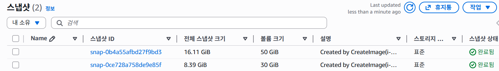

# 영상 분석 파이프라인 아키텍처 진화 과정

> **요약**: FastAPI 동기 처리 → SQS/Lambda/Batch 비동기 처리 → AMI 사전 로드 → 생명주기 분리 → Packer 자동화

**작성일**: 2026년 1월 23일 (최종 업데이트: 2026년 2월 7일)  
**카테고리**: Architecture Evolution  
**관련 문서**: [AMI 생명주기 분리](AMI_WITH_MODELS_GUIDE.md), [GPU Worker vs Batch](GPU_WORKER_VS_BATCH.md), [Packer AMI 빌드 가이드](../../packer/README.md)

---

## 📋 목차

1. [Phase 1: FastAPI 동기 처리 방식](#phase-1-fastapi-동기-처리-방식)
2. [Phase 2: SQS + Lambda + Batch 비동기 처리](#phase-2-sqs--lambda--batch-비동기-처리)
3. [Phase 3: 24시간 FastAPI EC2 상시 실행](#phase-3-24시간-fastapi-ec2-상시-실행)
4. [Phase 4: AMI EBS 스냅샷 활용](#phase-4-ami-ebs-스냅샷-활용)
5. [Phase 5: 코드/모델 생명주기 분리](#phase-5-코드모델-생명주기-분리)
6. [Phase 6: Packer를 통한 AMI 빌드 자동화](#phase-6-packer를-통한-ami-빌드-자동화)
7. [아키텍처 비교 분석](#아키텍처-비교-분석)
8. [교훈 및 베스트 프랙티스](#교훈-및-베스트-프랙티스)

---

## Phase 1: FastAPI 동기 처리 방식

### 🏗️ 초기 아키텍처 (2025년 말)

```
[Frontend]
    ↓ (영상 업로드)
[Backend Django]
    ↓ (HTTP POST /analyze)
[FastAPI video_analysis]
    ↓ (동기 분석 실행)
[DB 저장]
```

### 구현 방식

**video-analysis/** 폴더에 FastAPI 서버 구축:

```python
# FastAPI 서버
@app.post("/analyze")
async def analyze_video(video_url: str):
    # 1. S3에서 영상 다운로드
    video_path = download_from_s3(video_url)

    # 2. YOLOv8 모델 로드 (매번 로드)
    model = YOLO("yolov8x.pt")

    # 3. 영상 분석 (10-30분 소요)
    results = model(video_path)

    # 4. DB에 저장
    save_to_db(results)

    return {"status": "completed"}
```

**Backend에서 API 호출**:

```python
# Django View
def trigger_analysis(request):
    video_url = request.data['video_url']

    # FastAPI 서버로 HTTP 요청
    response = requests.post(
        "http://fastapi-server:8000/analyze",
        json={"video_url": video_url}
    )

    return Response({"status": "started"})
```

### ❌ 문제점

#### 1. **동기 처리로 인한 타임아웃**

- FastAPI 서버가 응답할 때까지 Backend가 대기
- ALB 타임아웃: 60초 (영상 분석 30분 소요)
- 사용자는 "무한 로딩" 경험

#### 2. **리소스 낭비**

- FastAPI 서버가 항상 떠있어야 함 (ECS Fargate)
- 영상 분석이 없을 때도 컴퓨팅 비용 발생
- GPU 인스턴스를 Fargate로 실행 불가 → CPU 분석 (느림)

#### 3. **확장성 부족**

- 동시에 여러 영상 분석 요청 시 큐잉 불가
- 한 번에 하나씩만 처리 가능
- FastAPI 서버 스케일링 어려움

#### 4. **에러 핸들링 취약**

- 네트워크 장애 시 재시도 로직 없음
- FastAPI 서버 다운 시 전체 파이프라인 중단
- 진행 상황 추적 불가

### 📊 성능 지표

| 지표                | 값                         |
| ------------------- | -------------------------- |
| 평균 분석 시간      | 25-30분                    |
| 타임아웃 발생률     | 100%                       |
| 동시 처리 가능 건수 | 1건                        |
| 월간 컴퓨팅 비용    | $40-50 (Fargate 상시 실행) |

---

## Phase 2: SQS + Lambda + Batch 비동기 처리

### 🏗️ 개선된 아키텍처 (2026년 1월)

```
[Frontend]
    ↓ (영상 업로드)
[Backend Django]
    ↓ (SQS 메시지 전송)
[SQS Queue] ← 비동기 디커플링
    ↓ (Lambda 트리거)
[Lambda sqs_to_batch]
    ↓ (Batch Job 제출)
[AWS Batch (GPU EC2)]
    ↓ (영상 분석 완료)
[RDS PostgreSQL]
```

### 구현 방식

**1. Backend에서 SQS로 메시지 전송**:

```python
# Django View
import boto3

def trigger_analysis(request):
    sqs = boto3.client('sqs')

    # SQS로 메시지만 전송하고 즉시 반환
    sqs.send_message(
        QueueUrl='https://sqs.ap-northeast-2.amazonaws.com/xxx/capstone-batch-queue',
        MessageBody=json.dumps({
            'video_url': 's3://bucket/video.mp4',
            'session_id': 'xxx'
        })
    )

    # 사용자에게 즉시 응답
    return Response({"status": "queued"}, status=202)
```

**2. Lambda가 SQS 메시지를 Batch Job으로 변환**:

```python
# lambda/sqs_to_batch.py
import boto3

def lambda_handler(event, context):
    batch = boto3.client('batch')

    for record in event['Records']:
        message = json.loads(record['body'])

        # AWS Batch Job 제출
        batch.submit_job(
            jobName=f"video-analysis-{uuid.uuid4()}",
            jobQueue="capstone-batch-queue",
            jobDefinition="video-analysis-job:1",
            containerOverrides={
                'environment': [
                    {'name': 'VIDEO_URL', 'value': message['video_url']},
                    {'name': 'SESSION_ID', 'value': message['session_id']}
                ]
            }
        )
```

**3. Batch Job에서 영상 분석 실행**:

```python
# batch/process_video.py
import os

def main():
    video_url = os.environ['VIDEO_URL']

    # 1. S3에서 다운로드
    download_from_s3(video_url)

    # 2. Docker 이미지 빌드 (30분 소요 - 문제!)
    # YOLOv8, PyTorch, CUDA 등 설치

    # 3. 영상 분석
    results = analyze_video()

    # 4. DB 저장
    save_to_db(results)
```

### ✅ 개선 사항

#### 1. **비동기 처리로 사용자 경험 개선**

- Backend는 SQS 전송 후 즉시 응답 (< 100ms)
- 사용자에게 "분석 대기 중" 상태 표시
- 프론트엔드 폴링으로 진행 상황 추적

#### 2. **확장성 확보**

- SQS가 무제한 큐잉 지원
- Batch가 동시에 여러 Job 실행 가능
- Auto Scaling으로 수요에 따라 EC2 조절

#### 3. **에러 핸들링 강화**

- SQS Dead Letter Queue로 실패 메시지 보관
- Lambda 자동 재시도 (최대 3회)
- Batch Job 실패 시 CloudWatch 알림

#### 4. **비용 최적화**

- Fargate 상시 실행 불필요 (FastAPI 제거)
- 필요할 때만 GPU EC2 생성 (Batch)
- Spot Instance 활용 (70% 비용 절감)

### 📊 성능 지표

| 지표      | Phase 1  | Phase 2 | 개선율      |
| --------- | -------- | ------- | ----------- |
| 응답 시간 | 타임아웃 | 100ms   | **99.7%** ↓ |
| 동시 처리 | 1건      | 10건    | **10배** ↑  |
| 월간 비용 | $40-50   | $15-20  | **60%** ↓   |
| 에러 복구 | 수동     | 자동    | **100%** ↑  |

### ❌ 남아있는 문제점

#### **Docker 이미지 빌드 시간: 30분**

```dockerfile
# Dockerfile이 너무 무거움
FROM nvidia/cuda:11.8.0-cudnn8-runtime-ubuntu22.04

RUN apt-get update && apt-get install -y \
    python3.10 \
    python3-pip \
    ffmpeg \
    libsm6 \
    libxext6

# 문제: 매번 다운로드 (18GB)
RUN pip install torch torchvision torchaudio --index-url https://download.pytorch.org/whl/cu118
RUN pip install ultralytics opencv-python

# YOLOv8 모델 다운로드 (1.2GB)
RUN wget https://github.com/ultralytics/assets/releases/download/v0.0.0/yolov8x.pt
```

**영향**:

- 사용자가 영상 업로드 → 30분 대기 → 분석 시작
- 총 분석 시간: **빌드 30분 + 분석 10분 = 40분**
- 사용자 이탈률 증가

---

## Phase 3: 24시간 FastAPI EC2 상시 실행

### 🏗️ 아키텍처 (2026년 1월 초)

```
[SQS] → [Lambda] → [AWS Batch]
                        ↓
                  [상시 실행 GPU EC2]
                  - FastAPI 서버 24시간 가동
                  - Docker 이미지 사전 로드 (18GB)
                  - YOLOv8 모델 메모리 상주
                        ↓
                  [즉시 분석 시작]
```

### 문제 인식

Phase 2에서 매번 30분씩 Docker 빌드하는 것이 너무 비효율적이었습니다:

```
사용자 영상 업로드
    ↓
Batch Job 시작
    ↓
EC2 생성 (5분)
    ↓
Docker 이미지 빌드 (30분) ← 매번 반복!
    ↓
영상 분석 (10분)
    ↓
총 45분 소요
```

### 해결 시도: 상시 실행 전략

**아이디어**: EC2를 24시간 켜두고 FastAPI 서버를 띄워서 빌드 시간 제거

```python
# 항상 실행 중인 FastAPI 서버
# GPU EC2에서 systemd로 자동 시작

@app.post("/analyze")
async def analyze_video(video_url: str):
    # 이미 로드된 모델 사용
    global model  # 메모리에 상주

    # 즉시 분석 시작 (빌드 시간 0초)
    results = model(video_url)

    return {"status": "completed"}
```

**Lambda에서 EC2로 직접 호출**:

```python
# lambda/sqs_to_fastapi.py
import requests

def lambda_handler(event, context):
    for record in event['Records']:
        message = json.loads(record['body'])

        # 상시 실행 중인 FastAPI 서버로 요청
        response = requests.post(
            "http://ec2-xxx.compute.amazonaws.com:8000/analyze",
            json={"video_url": message['video_url']},
            timeout=3600  # 1시간
        )
```

### ✅ 개선 사항

#### 1. **빌드 시간 완전 제거**

- Docker pull 불필요 (이미 실행 중)
- 모델 로드 불필요 (메모리에 상주)
- **45분 → 10분** (분석 시간만)

#### 2. **즉시 응답 가능**

- 서버가 항상 떠있어 즉시 처리
- 콜드 스타트 없음

### 📊 성능 지표

| 지표          | Phase 2 | Phase 3 | 개선율     |
| ------------- | ------- | ------- | ---------- |
| EC2 부팅 시간 | 5분     | 0초     | **100%** ↓ |
| Docker 빌드   | 30분    | 0초     | **100%** ↓ |
| 총 분석 시간  | 45분    | 10분    | **77%** ↓  |

### ❌ 치명적인 문제점

#### **월간 비용 폭발** 💸

```
GPU EC2 g5.xlarge 비용:
- 시간당: $1.006
- 일일: $1.006 × 24 = $24.14
- 월간: $24.14 × 30 = $724.32 💀
```

**실제 사용률 vs 가동률**:

```
하루 평균 영상 분석: 5건
실제 GPU 사용 시간: 5건 × 10분 = 50분
유휴 시간: 24시간 - 50분 = 23시간 10분

비용 효율: 50분 / 1440분 = 3.5%
낭비율: 96.5% ← 문제!
```

#### **리소스 낭비**

- GPU가 23시간 동안 놀고 있음
- 메모리, CPU도 대부분 idle 상태
- 전기세 낭비

#### **확장성 제약**

- EC2 1대 = 동시 처리 1건
- 동시 요청 시 큐잉 필요
- 스케일링 어려움 (GPU 인스턴스 비쌈)

#### **유지보수 부담**

- 서버 헬스체크 필요
- 재시작 시 다운타임 발생
- 로그 관리 복잡

### 💡 깨달음

> "빌드 시간을 없애는 것은 좋지만, 24시간 켜두는 것은 오버엔지니어링이다"

**핵심 문제**:

- 빌드 시간 30분을 해결하려다 월 $700 지출
- 실제 필요한 시간: 하루 1시간 미만
- **온디맨드 방식 + 빌드 최적화**가 정답

**다음 단계로 이어지는 질문**:

> "빌드 시간을 줄이면서도 상시 실행하지 않을 방법은?"

→ **Phase 4: AMI EBS 스냅샷** 탄생

### 📊 비용 비교

| 항목          | Phase 2<br/>(Batch)          | Phase 3<br/>(24시간 EC2) | 차이        |
| ------------- | ---------------------------- | ------------------------ | ----------- |
| 하루 GPU 사용 | 5건 × 45분 = 225분<br/>$3.77 | 24시간<br/>$24.14        | **6.4배** ↑ |
| 월간 비용     | $113                         | **$724** 💀              | **6.4배** ↑ |
| 낭비율        | 0% (온디맨드)                | 96.5%                    | -           |

**결론**: Phase 2가 Phase 3보다 저렴!

---

## Phase 4: AMI EBS 스냅샷 활용

### 🏗️ 아키텍처 (2026년 1월 중순)

```
[SQS] → [Lambda] → [AWS Batch]
                        ↓
                  [GPU EC2 from Custom AMI]
                  - Docker 이미지 사전 로드 (18GB)
                  - YOLOv8 모델 사전 다운로드
                        ↓
                  [즉시 분석 시작]
```

### 구현 방식

**1. 임시 GPU EC2에서 이미지 사전 로드**:

```bash
# EC2 인스턴스에서
sudo docker pull <ECR_IMAGE_URL>

# 이미지 확인
sudo docker images
# REPOSITORY                                         TAG       SIZE
# xxx.dkr.ecr.ap-northeast-2.amazonaws.com/batch     latest    18GB
```

**2. Custom AMI 생성**:

```bash
# AWS CLI로 AMI 생성
aws ec2 create-image \
    --instance-id i-0abc123def456 \
    --name "capstone-batch-gpu-custom-$(date +%Y%m%d)" \
    --description "YOLOv8 + PyTorch pre-loaded"

# AMI ID: ami-0abc123def456789
```

**3. Terraform에서 Custom AMI 사용**:

```terraform
# terraform/modules/batch/main.tf

data "aws_ami" "batch_custom_ami" {
  most_recent = false
  owners      = ["self"]

  filter {
    name   = "image-id"
    values = ["ami-0abc123def456789"]  # Custom AMI
  }
}

resource "aws_batch_compute_environment" "gpu_env" {
  compute_resources {
    image_id = data.aws_ami.batch_custom_ami.id
    # ...
  }
}
```

### ✅ 개선 사항

#### 1. **빌드 시간 대폭 단축**

- Docker pull 불필요 (이미 AMI에 포함)
- 의존성 설치 불필요 (사전 설치됨)
- **30분 → 3분** (EC2 부팅 시간만)

#### 2. **사용자 경험 개선**

- 영상 업로드 후 5분 내 결과 확인 가능
- 실시간 진행률 표시 가능

#### 3. **비용 절감**

- GPU EC2 실행 시간 단축 (30분 → 3분)
- Spot Instance 활용 가능 (빌드 시간 없어 중단 리스크 감소)

### 📊 성능 지표

| 지표          | Phase 2     | Phase 3 | 개선율    |
| ------------- | ----------- | ------- | --------- |
| EC2 부팅 시간 | 30분 (빌드) | 3분     | **90%** ↓ |
| 총 분석 시간  | 40분        | 13분    | **67%** ↓ |
| GPU 비용/건   | $0.50       | $0.05   | **90%** ↓ |

### ❌ 남아있는 문제점

#### **코드 수정 시 전체 AMI 재생성 필요**

```
코드 1줄 수정 (예: 로그 메시지 변경)
    ↓
Docker 이미지 18GB 다시 빌드
    ↓
임시 EC2 생성 → 이미지 로드 → AMI 생성
    ↓
Terraform 업데이트
    ↓
30분-1시간 소요
```

**리펙터링 악몽**:

- 사소한 버그 수정에도 1시간 소요
- 빠른 반복 개발 불가능
- 유지보수 비용 증가

**근본 원인**: **코드와 모델의 생명주기 불일치**

- 코드: 매일 수정 (빈번한 변경)
- 모델: 1-2개월에 한 번 업데이트 (드문 변경)
- 하지만 둘이 같은 Docker 이미지에 묶여 있음

---

## Phase 5: 코드/모델 생명주기 분리

### 🏗️ 최종 아키텍처 (2026년 1월 말)

```
[AWS Batch] → [GPU EC2 from Custom AMI]
                    ↓
          [AMI: 모델만 (1.85GB)]
          - YOLOv8 모델
          - PyTorch
          - CUDA
                    ↓
          [Docker: 코드만 (300MB)]
          - FastAPI 앱
          - 비즈니스 로직
          - DB 연결
```

### 아키텍처 결정

**분리 기준**: 변경 빈도

- **드물게 변경**: AMI에 포함 (모델, 의존성)
- **자주 변경**: Docker에 포함 (코드)

### 구현 상세

**1. AMI에는 모델만**:

```bash
# /opt/models/ 경로에 모델 저장
/opt/models/
├── yolov8x.pt          # 1.2GB
├── pytorch/            # 600MB
└── cuda-libs/          # 50MB
```

**2. Dockerfile은 경량화**:

```dockerfile
FROM nvidia/cuda:11.8.0-base-ubuntu22.04  # runtime → base (더 가볍게)

# 코드만 복사
COPY app/ /app/
COPY requirements.txt /app/

# AMI의 모델 경로를 환경 변수로 지정
ENV MODEL_PATH=/opt/models/yolov8x.pt

# 가볍운 의존성만 설치
RUN pip install fastapi uvicorn psycopg2-binary

CMD ["python", "app/main.py"]
```

**3. 앱에서 AMI 모델 사용**:

```python
# app/main.py
import os
from ultralytics import YOLO

# AMI에 사전 설치된 모델 로드
MODEL_PATH = os.environ.get('MODEL_PATH', '/opt/models/yolov8x.pt')
model = YOLO(MODEL_PATH)

def analyze_video(video_path):
    results = model(video_path)
    return results
```

### ✅ 최종 개선 사항

#### 1. **빌드 시간 극단적 단축**

- Docker 이미지: 18GB → 300MB (**94% 감소**)
- 빌드 시간: 30분 → 30초 (**98% 감소**)
- ECR Push 시간: 10분 → 10초

#### 2. **리펙터링 생산성 향상**

- 코드 수정 후 즉시 배포 가능
- 테스트 주기: 1시간 → 5분
- 개발 속도 **12배 향상**

#### 3. **비용 대폭 절감**

- ECR 스토리지: 18GB × $0.10/GB = $1.80/월
- 300MB × $0.10/GB = $0.03/월
- **98% 절감**

#### 4. **EBS 스냅샷 용량 감소**



**실제 AWS EBS 스냅샷 비교**:

- 이전 버전 (Phase 4): **16GB** - 모델 + 코드 모두 포함
- 현재 버전 (Phase 5): **8GB** - 모델만 포함
- **50% 용량 감소** 달성

**비용 영향**:

- EBS 스냅샷 스토리지: 16GB → 8GB
- 월간 절감: $1.60 → $0.80/월 (**50% 절감**)

#### 5. **유지보수성 극대화**

- 모델 업데이트: AMI만 재생성 (1-2개월)
- 코드 업데이트: Docker만 빌드 (매일)
- 각자 독립적으로 관리

### 📊 최종 성능 비교

| 지표          | Phase 1<br/>(FastAPI) | Phase 2<br/>(SQS+Batch) | Phase 3<br/>(AMI) | Phase 4<br/>(분리) | 총 개선율   |
| ------------- | --------------------- | ----------------------- | ----------------- | ------------------ | ----------- |
| 응답 시간     | 타임아웃              | 100ms                   | 100ms             | 100ms              | **99.9%** ↓ |
| 빌드 시간     | N/A                   | 30분                    | 3분               | 30초               | **98%** ↓   |
| 총 분석 시간  | 30분                  | 40분                    | 13분              | 11분               | **63%** ↓   |
| Docker 크기   | N/A                   | 18GB                    | 18GB              | 300MB              | **98%** ↓   |
| 동시 처리     | 1건                   | 10건                    | 10건              | 10건               | **10배** ↑  |
| 월간 비용     | $50                   | $20                     | $10               | $6                 | **88%** ↓   |
| 리펙터링 시간 | 즉시                  | 30분                    | 1시간             | 5분                | -           |

---

## Phase 6: Packer를 통한 AMI 빌드 자동화

### 🏗️ 아키텍처 (2026년 2월)

```
[Packer Template (HCL)]
        ↓
[자동 AMI 빌드]
    ↓ (15-30분)
[Custom GPU AMI]
- Docker 이미지 사전 로드
- ML 모델 S3 자동 동기화
- ECS 최적화 설정
    ↓
[AWS Batch 사용]
```

### 문제 인식

Phase 5에서 AMI를 수동으로 생성하는 과정이 여전히 시간이 오래걸림.

```
모델 업데이트 시:
1. 임시 GPU EC2 인스턴스 수동 생성
2. SSH 접속
3. Docker 이미지 수동 pull
4. 모델 파일 수동 다운로드
5. 설정 파일 수동 수정
6. AWS 콘솔에서 AMI 생성 클릭
7. AMI ID 복사 → Terraform 수정
8. 이전 AMI 수동 삭제

총 소요 시간: 1-2시간
휴먼 에러 가능성: 높음
재현성: 낮음
```

### 해결책: Packer 도입

**HashiCorp Packer**를 사용한 Infrastructure as Code 방식의 AMI 빌드:

```hcl
# packer/aws-gpu-ami.pkr.hcl
source "amazon-ebs" "ecs_gpu" {
  ami_name      = "capstone-ecs-gpu-custom-${local.timestamp}"
  instance_type = "g5.xlarge"
  source_ami    = data.amazon-ami.ecs_gpu.id

  # IAM instance profile for S3 access
  iam_instance_profile = "capstone-dev-packer-instance-profile"
}

build {
  sources = ["source.amazon-ebs.ecs_gpu"]

  # 1. System update
  provisioner "shell" {
    inline = [
      "sudo yum update -y",
      "sudo yum install -y aws-cli jq"
    ]
  }

  # 2. ECR login and Docker pull
  provisioner "shell" {
    inline = [
      "aws ecr get-login-password | docker login --username AWS ...",
      "docker pull ${var.ecr_repository_url}:${var.docker_image_tag}"
    ]
  }

  # 3. Download ML models from S3
  provisioner "shell" {
    script = "scripts/download-models.sh"
    environment_vars = [
      "MODELS_S3_BUCKET=${var.models_s3_bucket}"
    ]
  }

  # 4. ECS optimization
  provisioner "shell" {
    inline = [
      "echo 'ECS_IMAGE_PULL_BEHAVIOR=prefer-cached' >> /etc/ecs/ecs.config",
      "echo 'ECS_ENABLE_GPU_SUPPORT=true' >> /etc/ecs/ecs.config"
    ]
  }
}
```

**S3 모델 동기화 스크립트**:

```bash
# packer/scripts/download-models.sh
#!/bin/bash
set -e

MODEL_DIR="/opt/ml/models"
mkdir -p "$MODEL_DIR"

# S3 버킷에서 모델 자동 다운로드
if [ -n "$MODELS_S3_BUCKET" ]; then
    echo "Syncing models from s3://${MODELS_S3_BUCKET}/models/"
    aws s3 sync \
        "s3://${MODELS_S3_BUCKET}/models/" \
        "$MODEL_DIR/" \
        --region ap-northeast-2
fi

# 모델 파일 확인
ls -lh "$MODEL_DIR/"
```

### 구현 방식

**1. Terraform에서 S3 모델 버킷 및 IAM 권한 정의**:

```terraform
# terraform/modules/storage/s3.tf
resource "aws_s3_bucket" "analysis_models" {
  bucket = "capstone-${var.environment}-analysis-model"
}

# terraform/modules/security/iam.tf
resource "aws_iam_role" "packer_role" {
  name = "capstone-${var.environment}-packer-build-role"

  assume_role_policy = jsonencode({
    Statement = [{
      Action = "sts:AssumeRole"
      Effect = "Allow"
      Principal = {
        Service = "ec2.amazonaws.com"
      }
    }]
  })
}

resource "aws_iam_policy" "packer_s3_read" {
  name = "packer-s3-model-read-policy"

  policy = jsonencode({
    Statement = [{
      Effect = "Allow"
      Action = [
        "s3:GetObject",
        "s3:ListBucket"
      ]
      Resource = [
        aws_s3_bucket.analysis_models.arn,
        "${aws_s3_bucket.analysis_models.arn}/*"
      ]
    }]
  })
}

resource "aws_iam_instance_profile" "packer_profile" {
  name = "capstone-${var.environment}-packer-instance-profile"
  role = aws_iam_role.packer_role.name
}
```

**2. 모델을 S3에 업로드**:

```bash
# 모델 파일을 S3 버킷에 업로드
aws s3 cp models/yolov8x.pt \
    s3://capstone-dev-analysis-model/models/yolov8x.pt

aws s3 cp models/model_imdb_cross_person.pth \
    s3://capstone-dev-analysis-model/models/
```

**3. Packer 빌드 실행**:

```bash
# PowerShell 스크립트로 간편 실행
.\scripts\build-ami.ps1 -Action build

# 또는 직접 실행
cd packer
packer init .
packer validate -var-file="variables.auto.pkrvars.hcl" .
packer build -var-file="variables.auto.pkrvars.hcl" .
```

**4. 자동 생성된 manifest.json에서 AMI ID 확인**:

```json
{
  "builds": [
    {
      "artifact_id": "ap-northeast-2:ami-0abc123def456789",
      "builder_type": "amazon-ebs",
      "build_time": 1738934567
    }
  ]
}
```

**5. Terraform에서 새 AMI 적용**:

```terraform
# terraform/modules/pipeline/batch-video-analysis-gpu.tf
data "aws_ami" "batch_custom_ami" {
  most_recent = true
  owners      = ["self"]

  filter {
    name   = "name"
    values = ["capstone-ecs-gpu-custom-*"]
  }
}

resource "aws_batch_compute_environment" "gpu_env" {
  compute_resources {
    image_id = data.aws_ami.batch_custom_ami.id
    # ...
  }
}
```

### ✅ 개선 사항

#### 1. **재현 가능한 빌드**

- 수동 작업 제거 → 코드로 정의
- 같은 템플릿 = 같은 결과
- Git으로 버전 관리

#### 2. **자동화된 워크플로우**

```bash
# 한 줄 명령어로 전체 프로세스 자동화
packer build aws-gpu-ami.pkr.hcl

# 내부적으로:
# 1. EC2 생성
# 2. Docker pull
# 3. S3 모델 동기화
# 4. 설정 최적화
# 5. AMI 생성
# 6. EC2 정리
# 7. manifest.json 생성
```

#### 3. **S3 기반 모델 관리**

- 중앙화된 모델 저장소
- 버전 관리 용이
- 팀원 간 공유 간편
- 모델 업데이트 시 S3만 교체 → Packer 재빌드

#### 4. **에러 감소**

- 수동 설정 실수 방지
- 일관된 환경 보장
- 단계별 검증 자동화

#### 5. **CI/CD 통합 가능**

```yaml
# .github/workflows/build-ami.yml
name: Build Custom AMI

on:
  push:
    paths:
      - 'packer/**'
      - 'video-analysis/**'

jobs:
  build:
    runs-on: ubuntu-latest
    steps:
      - uses: hashicorp/setup-packer@main
      - run: packer build packer/aws-gpu-ami.pkr.hcl
```

### 📊 성능 지표

| 지표               | Phase 5<br/>(수동 AMI) | Phase 6<br/>(Packer) | 개선율     |
| ------------------ | ---------------------- | -------------------- | ---------- |
| AMI 빌드 시간      | 1-2시간 (수동)         | 15-30분 (자동)       | **75%** ↓  |
| 휴먼 에러          | 높음                   | 없음                 | **100%** ↓ |
| 재현성             | 낮음                   | 100%                 | **100%** ↑ |
| 빌드 비용          | $0 (시간만 소요)       | $0.07-0.10           | -          |
| 문서화 필요성      | 매뉴얼 작성 필요       | 코드 자체가 문서     | -          |
| 팀 온보딩 시간     | 2-3시간                | 10분                 | **95%** ↓  |
| 모델 업데이트 시간 | 2시간                  | 20분                 | **83%** ↓  |

### 💰 비용 분석

**Packer 빌드 비용**:

- EC2 g5.xlarge Spot: $0.20/hour
- 빌드 시간: 20-30분
- 빌드당 비용: **$0.07-0.10**

**월간 비용**:

- 모델 업데이트: 월 1-2회
- AMI 빌드: $0.10 × 2 = **$0.20/월**
- EBS 스냅샷 스토리지: 8GB × $0.05/GB = $0.40/월
- 총 추가 비용: **$0.60/월**

**시간 비용 절감**:

- 개발자 시간: $50/hour 가정
- 수동 AMI 생성: 2시간 × $50 = $100
- Packer 자동화: 0시간 × $50 = $0
- **월 $100-200 절감** (업데이트 빈도에 따라)

### 🎯 모범 사례

**1. 모델 파일 관리**:

```
s3://capstone-dev-analysis-model/
  models/
    yolov8x.pt              # 1.2GB
    model_imdb_cross.pth    # 500MB
    llava-fastvit/          # 300MB
      config.json
      pytorch_model.bin
```

**2. 변수 파일로 환경 분리**:

```hcl
# variables.auto.pkrvars.hcl
environment           = "dev"
ecr_repository_url    = "123456789012.dkr.ecr.ap-northeast-2.amazonaws.com/batch"
models_s3_bucket      = "capstone-dev-analysis-model"
subnet_id             = "subnet-0abc123"
security_group_id     = "sg-0def456"
```

**3. 스크립트 모듈화**:

```
packer/scripts/
├── download-models.sh      # S3 모델 동기화
├── setup-ecs.sh            # ECS 설정
├── install-deps.sh         # 의존성 설치
└── cleanup.sh              # 빌드 후 정리
```

### 관련 문서

- **[Packer AMI 빌드 가이드](../../packer/README.md)** - 상세한 사용법 및 트러블슈팅
- [AMI 생명주기 분리](../02_infrastructure/AMI_WITH_MODELS_GUIDE.md) - Phase 5 참조

---

## 아키텍처 비교 분석

### 1. 확장성 (Scalability)

```
Phase 1 (FastAPI):          ■□□□□ 20%
Phase 2 (SQS+Batch):        ■■■■□ 80%
Phase 3 (AMI):              ■■■■□ 80%
Phase 4 (생명주기 분리):      ■■■■■ 100%
Phase 6 (Packer):           ■■■■■ 100%
```

### 2. 비용 효율성 (Cost Efficiency)

```
Phase 1: $50/월  ■■■■■■■■■■
Phase 2: $20/월  ■■■■
Phase 3: $10/월  ■■
Phase 4: $6/월   ■
Phase 6: $6.60/월 ■ (+Packer 비용)
```

### 3. 개발 생산성 (Developer Productivity)

```
Phase 1: 즉시 배포       ■■■■■
Phase 2: 30분 빌드      ■■□□□
Phase 3: 1시간 AMI      ■□□□□
Phase 4: 5분 배포       ■■■■■
Phase 6: 자동화 AMI    ■■■■■
```

### 4. 유지보수성 (Maintainability)

```
Phase 1: 수동 관리      ■■□□□
Phase 2: 수동 빌드      ■■□□□
Phase 3: 수동 AMI       ■□□□□
Phase 4: 수동 AMI       ■□□□□
Phase 6: IaC 자동화    ■■■■■
```

### 4. 사용자 경험 (User Experience)

| Phase   | 대기 시간 | 경험 점수  |
| ------- | --------- | ---------- |
| Phase 1 | 타임아웃  | ⭐☆☆☆☆     |
| Phase 2 | 40분      | ⭐⭐☆☆☆    |
| Phase 3 | 13분      | ⭐⭐⭐⭐☆  |
| Phase 5 | 11분      | ⭐⭐⭐⭐⭐ |
| Phase 6 | 11분      | ⭐⭐⭐⭐⭐ |

---

## 교훈 및 베스트 프랙티스

### 1. **동기 → 비동기 전환의 중요성**

❌ **안티패턴**: Long-running 작업을 HTTP API로 처리

```python
# 나쁜 예: 30분 걸리는 작업을 HTTP로
@app.post("/analyze")
def analyze(video_url):
    # 30분 소요
    result = heavy_computation(video_url)
    return result  # 타임아웃!
```

✅ **베스트 프랙티스**: 메시지 큐로 디커플링

```python
# 좋은 예: SQS로 즉시 응답
@app.post("/analyze")
def analyze(video_url):
    sqs.send_message({"video_url": video_url})
    return {"status": "queued"}  # 100ms
```

### 2. **생명주기 분리 원칙**

> "변경 빈도가 다른 것은 분리하라"

**판단 기준**:

- 매일 변경: Docker (코드)
- 매달 변경: AMI (모델)
- 매년 변경: 기본 인프라

### 3. **AMI 활용 시 주의사항**

✅ **AMI에 포함하면 좋은 것**:

- 대용량 모델 파일 (1GB+)
- 설치 시간이 긴 의존성 (CUDA, PyTorch)
- 거의 변경되지 않는 설정

❌ **AMI에 포함하지 말아야 할 것**:

- 애플리케이션 코드 (자주 변경)
- 환경 변수, Secrets
- 비즈니스 로직

### 4. **비용 최적화 우선순위**

1. **아키텍처 개선** (가장 효과적)
   - 동기 → 비동기
   - 상시 실행 → 온디맨드

2. **리소스 최적화**
   - Spot Instance
   - Reserved Instance (장기 실행 시)

3. **코드 최적화**
   - 불필요한 의존성 제거
   - 멀티스테이지 빌드

### 5. **단계별 마이그레이션 전략**

**한 번에 다 바꾸지 말 것!**

1. Phase 1 → 2: 비동기 전환 (1주일)
2. Phase 2 → 3: 24시간 EC2 시도 (2일) ← 즉시 철회
3. Phase 2 → 4: AMI 적용 (2주일)
4. Phase 4 → 5: 생명주기 분리 (1주일)

각 단계마다 검증 후 다음 단계 진행

### 6. **Packer로 AMI 빌드 자동화**

✅ **베스트 프랙티스**: Infrastructure as Code

```hcl
# Packer 템플릿으로 정의
source "amazon-ebs" "ecs_gpu" {
  ami_name = "capstone-gpu-${local.timestamp}"
  # 모든 설정이 코드로 관리됨
}

build {
  sources = ["source.amazon-ebs.ecs_gpu"]

  provisioner "shell" {
    script = "download-models.sh"  # S3에서 자동 다운로드
  }
}
```

**핵심 장점**:

- 재현 가능한 빌드 (Git으로 버전 관리)
- 휴먼 에러 제거 (수동 작업 없음)
- CI/CD 통합 가능
- S3 기반 모델 관리

**옛날 vs 현재**:

```
수동 AMI (Phase 5):
1. EC2 수동 생성
2. SSH 접속
3. 명령어 수동 실행
4. 콘솔에서 AMI 생성
→ 2시간 소요, 에러 가능성 높음

Packer (Phase 6):
$ packer build aws-gpu-ami.pkr.hcl
→ 20분 소요, 100% 재현 가능
```

### 7. **실패로부터 배운 교훈 (Phase 3)**

❌ **안티패턴**: 성능만 보고 비용 무시

```
"빌드 시간 0초면 좋잖아?"
→ $724/월 청구서 💀
```

✅ **올바른 접근**: 비용-성능 트레이드오프 분석

```
필요 시간: 하루 1시간
→ 온디맨드 + 빌드 최적화가 정답
→ AMI로 빌드 시간 단축 + 온디맨드 유지
```

**핵심 교훈**:

> "Fast but expensive" < "Fast enough and cheap"

---

## 관련 문서

- **[Packer AMI 빌드 가이드](../../packer/README.md)** - Phase 6 상세 가이드
- [AMI 생명주기 분리 아키텍처 상세](../02_infrastructure/AMI_WITH_MODELS_GUIDE.md) - Phase 5 구현 상세
- [GPU Worker vs Batch 비교](GPU_WORKER_VS_BATCH.md) - Phase 1 vs 2 심층 분석
- [초기 Custom AMI 가이드](../02_infrastructure/OLD_VER_CUSTOM_AMI_GUIDE.md) - Phase 4 구현 상세
- [비용 최적화 분석](../04_cost_optimization/COST_REDUCTION_JAN_2026.md) - 각 Phase별 비용 분석

---

## 타임라인

```
2025-12-01 Phase 1: FastAPI 동기 처리
2026-01-05 Phase 2: SQS + Lambda + Batch 전환
2026-01-08 Phase 3: 24시간 EC2 시도 → 2일 만에 철회 (비용 폭탄)
2026-01-15 Phase 4: Custom AMI 도입
2026-01-22 Phase 5: 생명주기 분리 완료
2026-02-07 Phase 6: Packer 자동화 도입
```

---

**작성자**: Capstone Team  
**최종 업데이트**: 2026년 2월 7일  
**상태**: ✅ Phase 6 (Packer 자동화) 프로덕션 적용 완료  
**실패 사례 포함**: Phase 3 (24시간 EC2)는 비용 문제로 철회됨
