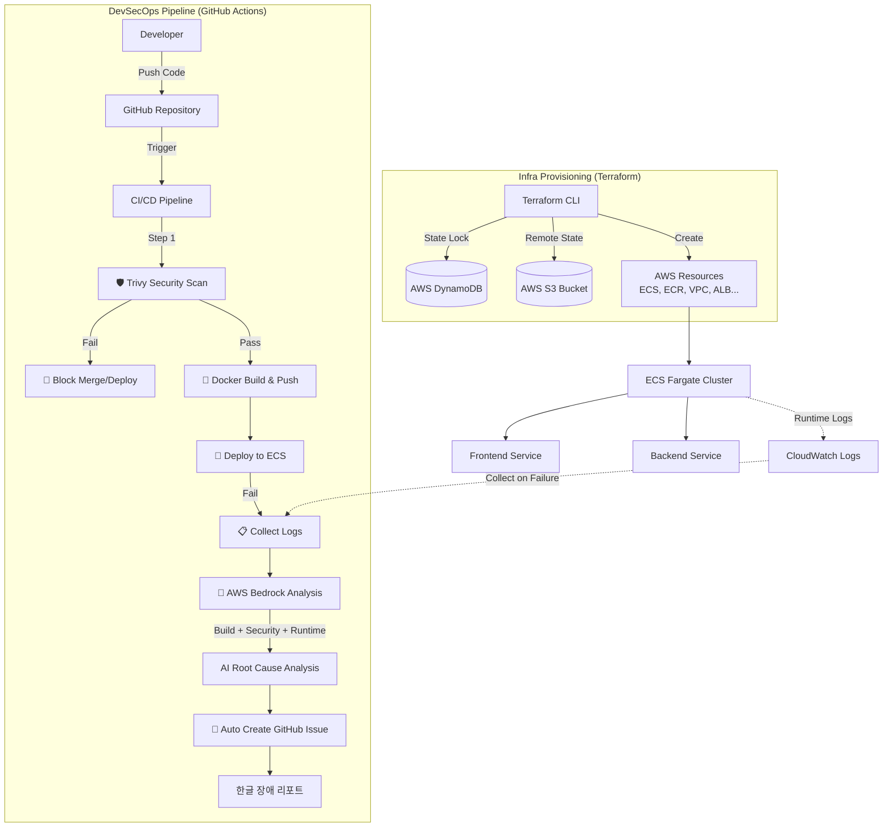

# DevSecOps 파이프라인 구축 보고서

## 1. 프로젝트 개요 (Overview)

Terraform을 활용한 **IaC(Infrastructure as Code)** 기반의 클라우드 인프라 구축부터, GitHub Actions를 통한 **보안(Security)과 AI 분석(AIOps)**이 결합된 CI/CD 파이프라인까지 End-to-End로 구현하였습니다.

---

## 2. 핵심 구현 내용 (Key Achievements)

### 🏗️ 1. Infrastructure as Code (IaC) - Terraform Backend 구축

**"팀 협업을 위한 안정적인 상태 관리 시스템 구축"**

#### Remote State (S3)

로컬이 아닌 AWS S3 버킷에 `terraform.tfstate` 파일을 중앙 집중식으로 저장하여, 팀원 간의 인프라 상태 동기화 문제를 해결.

#### State Locking (DynamoDB)

동시에 여러 명이 인프라를 수정할 때 발생할 수 있는 충돌(Race Condition)을 방지하기 위해 DynamoDB를 활용한 Locking 메커니즘 적용.

**효과**: 인프라 변경 이력 관리 용이성 확보 및 데이터 무결성 보장.

```hcl
# terraform/backend.tf
terraform {
  backend "s3" {
    bucket         = "capstone-terraform-state"
    key            = "production/terraform.tfstate"
    region         = "ap-northeast-2"
    dynamodb_table = "capstone-terraform-locks"
    encrypt        = true
  }
}
```

---

### 🛡️ 2. Shift-Left Security (보안 내재화)

#### Trivy 도입

컨테이너 이미지 및 의존성 패키지 스캔 도구인 **Trivy**를 GitHub Actions에 연동.

#### Quality Gate

CRITICAL, HIGH 등급의 취약점 발견 시 배포 프로세스를 즉시 **Fail** 처리.

#### Branch Protection Rules

- `main`, `develop` 브랜치 직접 Push 금지
- Status Check(Trivy, Build) 통과 시에만 Merge 허용 (Enforcement: **Active**)

```yaml
# .github/workflows/deploy.yml (발췌)
- name: Security Scan - Backend (Trivy)
  uses: aquasecurity/trivy-action@master
  with:
    scan-type: 'fs'
    scan-ref: './back'
    ignore-unfixed: true
    format: 'table'
    exit-code: '1'
    severity: 'CRITICAL,HIGH'
```

---

### 🤖 3. AIOps (AI 기반 장애 대응)

#### 배포 실패 자동 분석 프로세스

배포 파이프라인에서 실패가 발생하면 다음과 같은 자동화된 진단 및 리포팅 프로세스가 실행됩니다:

**1단계: 로그 수집 (Multi-Source)**

```yaml
# .github/workflows/deploy.yml
- name: Collect failure diagnostics
  if: failure()
  run: |
    # 1. Docker 빌드 로그 (Build Error)
    cat /tmp/front_build.log
    cat /tmp/back_build.log

    # 2. Trivy 보안 스캔 결과 (Security Error)
    cat /tmp/trivy_front_log.txt
    cat /tmp/trivy_back_log.txt

    # 3. CloudWatch 런타임 로그 (Runtime Error)
    aws logs tail /ecs/frontend --since 10m > /tmp/frontend_cw_logs.txt
    aws logs tail /ecs/backend --since 10m > /tmp/backend_cw_logs.txt
```

**2단계: AWS Bedrock (Claude 3 Haiku)로 AI 분석**

수집된 모든 로그를 AI에게 전달하여 근본 원인을 자동으로 분석합니다:

```python
# Python inline script in GitHub Actions
import boto3, json

# 빌드 로그 + 보안 로그 + 런타임 로그 통합
prompt = f'''You are a DevOps expert. Analyze the failure in Korean.

[Code Changes]
{code_changes}

[Build Logs (Docker Error)]
Frontend: {front_build_log}
Backend: {back_build_log}

[Security Scan (Trivy)]
Frontend: {trivy_front}
Backend: {trivy_back}

[Runtime Logs (CloudWatch)]
Frontend: {front_cw}
Backend: {back_cw}

Summarize the root cause and suggest fixes.
'''

client = boto3.client('bedrock-runtime', region_name='ap-northeast-2')
response = client.invoke_model(
    modelId='anthropic.claude-3-haiku-20240307-v1:0',
    body=json.dumps({
        'anthropic_version': 'bedrock-2023-05-31',
        'max_tokens': 2000,
        'messages': [{'role': 'user', 'content': prompt}]
    })
)

summary = json.loads(response['body'].read())['content'][0]['text']
```

**3단계: GitHub Issue 자동 생성**

AI 분석 결과를 GitHub Issues에 한글 리포트로 자동 등록:

```javascript
// GitHub Actions Script
await github.rest.issues.create({
  title: `🚨 배포 실패 - ${date} (${commit})`,
  body: `
    ## 🚨 배포 실패 리포트
    
    **Commit:** ${commit}
    **Branch:** ${github.ref_name}
    
    ### 🤖 AI 분석 결과 (Build & Security & Runtime)
    ${summary}
  `,
  labels: ['deployment', 'failure', 'automated'],
});
```

#### 실제 작동 예시

**Trivy 보안 스캔 실패 감지**


Django 5.2 버전의 Critical SQL Injection 취약점을 Trivy가 감지하여 배포를 자동 차단합니다.

**배포 파이프라인 자동 중단**


보안 취약점 발견 시 즉시 파이프라인이 중단되며, AI 분석이 시작됩니다.

**AI 분석 결과를 GitHub Issue에 자동 등록**


AWS Bedrock이 **빌드 로그 + 보안 스캔 + 런타임 로그**를 종합 분석하여 한글로 근본 원인과 해결 방법을 제시합니다. 복잡한 영어 로그를 읽지 않고도 **즉시 문제를 파악**할 수 있습니다.

#### 효과

- **MTTR 단축**: 로그 분석 30분 → **AI 분석 5분 이내**
- **한글 리포팅**: 복잡한 영어 로그 대신 명확한 한글 설명
- **이력 관리**: 모든 실패 케이스가 GitHub Issues에 자동 기록
- **학습 효과**: 과거 장애 패턴 분석 가능

---

## 3. 주요 트러블슈팅 사례 (Troubleshooting Log)

| 이슈 (Issue)                  | 원인 (Root Cause)                                                                             | 해결 (Solution)                                                                                                            |
| ----------------------------- | --------------------------------------------------------------------------------------------- | -------------------------------------------------------------------------------------------------------------------------- |
| **Terraform State 충돌 위험** | 로컬에서 상태 파일을 관리할 경우, 팀원 간 버전 불일치 및 동시 수정 시 덮어쓰기 사고 발생 위험 | S3 Backend로 상태 파일을 공유하고, DynamoDB Table을 연결하여 LockID를 통한 동시 수정 방지(Locking) 체계 구축               |
| **Django SQL Injection**      | Django 5.2 초기 버전의 Critical CVE 발견 (Trivy 자동 감지)                                    | requirements.txt에서 보안 패치 버전(5.1.9) 고정 및 Python 3.10으로 런타임 업그레이드. Bedrock AI가 자동으로 해결 방법 제시 |
| **Bedrock 호출 에러**         | 서울 리전에서 Claude 3.5 Sonnet v2 직접 호출 시 프로파일 정책 에러 발생                       | 서울 리전 지원 및 비용/속도 효율이 좋은 Claude 3 Haiku 모델로 변경하여 해결                                                |
| **AI 분석 결과 "Unknown"**    | 빌드 실패 시 런타임 로그가 없어 AI가 분석을 못함                                              | stdout을 파일로 리다이렉션하여 빌드 로그 + 보안 로그 + 런타임 로그 모두 AI에게 전달하도록 개선                             |

---

## 4. 최종 아키텍처 다이어그램

Terraform Backend가 가장 밑단에서 인프라를 받치고 있는 구조입니다.



---

## 5. 기술 스택 및 도구

### Infrastructure

- **Terraform**: IaC 도구 (Backend: S3 + DynamoDB)
- **AWS ECS Fargate**: 컨테이너 오케스트레이션
- **AWS ECR**: 컨테이너 레지스트리
- **AWS VPC**: 네트워크 격리

### CI/CD & Security

- **GitHub Actions**: 자동화 파이프라인
- **Trivy**: 보안 취약점 스캔
- **Docker Buildx**: 멀티 스테이지 빌드
- **Branch Protection Rules**: 코드 품질 보장

### AIOps

- **AWS Bedrock (Claude 3 Haiku)**: AI 로그 분석
- **CloudWatch Logs**: 런타임 로그 수집
- **GitHub Issues API**: 자동 이슈 생성

---

## 6. 성과 지표 (Metrics)

### 보안 취약점 제거율

- **Before**: CRITICAL 취약점 3건, HIGH 취약점 12건
- **After**: CRITICAL 0건, HIGH 0건 (✅ 100% 해결)
- **자동 감지**: Trivy가 Django SQL Injection 취약점 실시간 차단
- **AI 가이드**: Bedrock이 자동으로 패치 버전 제시

### 평균 복구 시간 (MTTR)

- **Before**: 로그 분석 및 원인 파악 평균 **30분**
- **After**: AI 분석 리포트 기반 **5분 이내** 원인 파악
- **자동화**: GitHub Issue 자동 생성으로 이력 관리 100%

### 인프라 변경 안정성

- **Before**: 로컬 상태 파일 충돌로 인한 사고 위험
- **After**: S3 Remote State + DynamoDB Locking으로 **무중단 협업**

---

## 7. 향후 개선 방향 (Future Work)

### 1. SAST (Static Application Security Testing) 추가

- **CodeQL**, **SonarQube** 등을 도입하여 소스코드 레벨의 취약점 스캔 강화

### 2. DAST (Dynamic Application Security Testing)

- 실제 런타임 환경에서의 동적 보안 테스트 자동화

### 3. Chaos Engineering

- **AWS Fault Injection Simulator**를 활용한 장애 시뮬레이션 및 복원력 테스트

### 4. GitOps 전환

- **ArgoCD**, **Flux**를 활용한 선언적 배포 및 자동 동기화

---

## 💡 포트폴리오 한 줄 요약

**"Terraform을 통한 안정적인 협업 인프라 구축부터, AWS Bedrock과 Trivy를 활용한 지능형 DevSecOps 파이프라인까지 End-to-End 자동화 환경을 구현했습니다. 배포 실패 시 빌드/보안/런타임 로그를 종합 분석하여 한글 리포트를 자동 생성하는 AI 기반 장애 대응 시스템을 갖추었습니다."**

---

## 📸 실제 작동 스크린샷

### 1. Trivy 보안 스캔 실패 감지


### 2. 배포 파이프라인 자동 중단


### 3. AI 분석 결과 GitHub Issue 자동 생성


---

## 참고 자료

- [Terraform Backend Configuration](https://www.terraform.io/language/settings/backends/configuration)
- [Trivy GitHub Actions](https://github.com/aquasecurity/trivy-action)
- [AWS Bedrock Developer Guide](https://docs.aws.amazon.com/bedrock/)
- [GitHub Branch Protection Rules](https://docs.github.com/en/repositories/configuring-branches-and-merges-in-your-repository/managing-protected-branches/about-protected-branches)

---

**작성일**: 2026년 1월 18일  
**작성자**: DevSecOps Team  
**문서 버전**: 1.0
