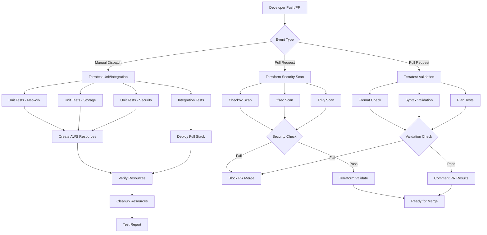
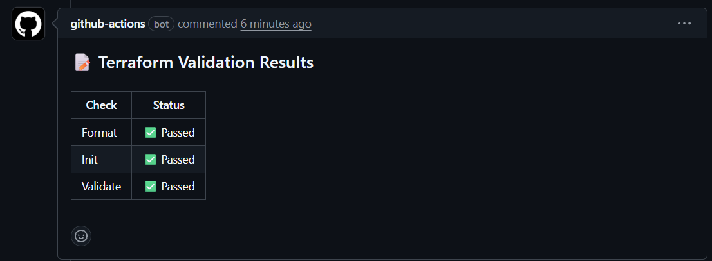
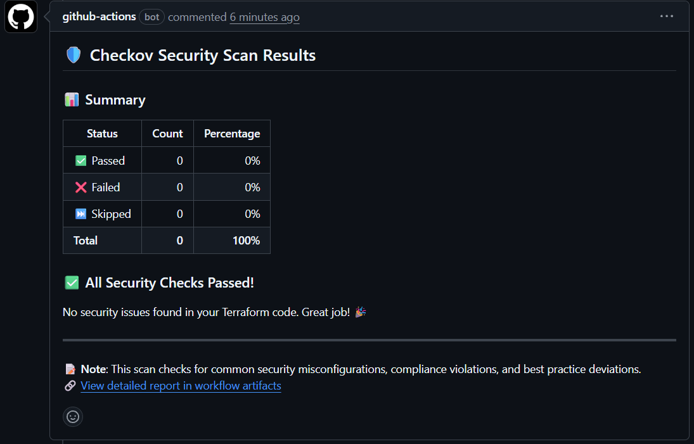
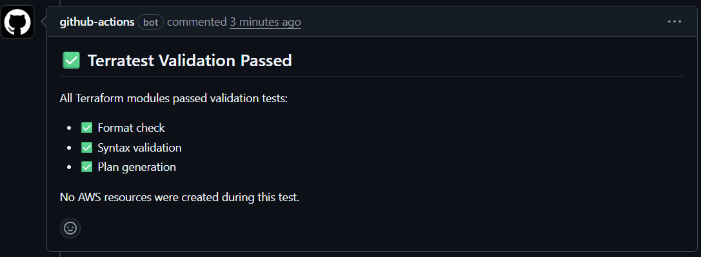

# 🔒 Secure IaC Pipeline 구축 개요

**작업 일자**: 2026년 2월 6일  
**작업자**: DeepSentinel Team  
**브랜치**: `feat/secure-iac-pipeline`

> **상세 문서**
>
> - [Policy as Code 상세 구현](./POLICY_AS_CODE_DETAILS.md)
> - [Terratest 인프라 테스팅 상세](./TERRATEST_DETAILS.md)
> - [트러블슈팅 가이드](./TROUBLESHOOTING_GUIDE.md)

---

## 📋 목차

- [배경 및 목표](#배경-및-목표)
- [주요 구현 내용](#주요-구현-내용)
- [워크플로우 아키텍처](#워크플로우-아키텍처)
- [실행 결과](#실행-결과)
- [비용 최적화](#비용-최적화)
- [성과 및 결론](#성과-및-결론)

---

## 배경 및 목표

### 🚨 문제 정의

기존 Terraform CI/CD 파이프라인은 기본적인 `terraform validate`와 `terraform plan` 검증만 수행했습니다. 이는 다음과 같은 보안 및 품질 문제를 야기했습니다:

#### 1. 보안 정책 검증 부재

```
문제: S3 버킷이 public으로 노출되는지, IAM 권한이 과도한지 코드 리뷰만으로 확인 불가능
결과: 보안 취약점이 프로덕션 환경에 배포된 후에야 발견됨
```

#### 2. 인프라 코드 품질 보장 부재

```
문제: Terraform 모듈이 실제로 AWS 리소스를 올바르게 생성하는지 검증 없음
결과: 배포 후 리소스 생성 실패나 예상치 못한 동작으로 인한 장애 발생
```

#### 3. 컴플라이언스 요구사항 미충족

```
문제: CIS Benchmark, GDPR, HIPAA 등의 규정 준수 여부를 수동으로 확인
결과: 감사(Audit) 시 규정 위반 사항 발견, 재작업 비용 증가
```

### 🎯 목표

1. **Shift-Left Security**: 코드 작성 단계에서부터 보안 정책 자동 검증
2. **Infrastructure Testing**: Terraform 모듈의 실제 동작 검증 (Unit/Integration Test)
3. **컴플라이언스 자동화**: 클라우드 보안 표준(CIS, AWS Well-Architected) 자동 검사
4. **비용 효율성**: 무료 검증(Validation)과 유료 테스트(Unit/Integration) 분리
5. **재현 가능한 인프라**: Packer를 통한 불변 인프라(Immutable Infrastructure) 구현

---

## 주요 구현 내용

### 1. 🛡️ Policy as Code - 다층 보안 검증

**Checkov**, **tfsec**, **Trivy** 세 가지 도구를 조합하여 Terraform 코드의 보안 취약점을 다각도로 검증합니다.

| 도구        | 주요 기능                 | 검증 범위              | 출력 형식    |
| ----------- | ------------------------- | ---------------------- | ------------ |
| **Checkov** | 800+ 정책 검사            | AWS, Azure, GCP 등     | JSON, SARIF  |
| **tfsec**   | Terraform 특화 보안 스캔  | AWS 보안 그룹, S3, IAM | SARIF, JSON  |
| **Trivy**   | 설정 파일 + 컨테이너 스캔 | IaC + Docker 이미지    | Table, SARIF |

**주요 검증 항목:**

- ❌ S3 버킷 Public Access 허용
- ❌ RDS 인스턴스 암호화 미적용
- ❌ Security Group에서 0.0.0.0/0 인바운드 허용
- ❌ IAM 정책에서 `*` 권한 사용
- ❌ CloudTrail 로깅 비활성화

**Quality Gate**: CRITICAL 또는 HIGH 등급 취약점 발견 시 PR 병합 차단

👉 [Policy as Code 상세 구현 문서 보기](./POLICY_AS_CODE_DETAILS.md)

---

### 2. 🧪 Infrastructure Testing - Terratest

**Terratest**(Go 기반)를 사용하여 Terraform 모듈이 실제 AWS 환경에서 의도대로 동작하는지 검증합니다.

#### 3-Tier Testing Strategy

| 레벨       | 테스트 유형 | 리소스 생성    | 비용   | 실행 조건 |
| ---------- | ----------- | -------------- | ------ | --------- |
| **Tier 1** | Validation  | ❌ 없음        | $0     | 모든 PR   |
| **Tier 2** | Unit Test   | ✅ 모듈별 생성 | ~$0.50 | 수동 실행 |
| **Tier 3** | Integration | ✅ 전체 스택   | ~$1-2  | 수동 실행 |

**Validation 테스트 (무료, 자동 실행):**

- `terraform fmt` 검사
- `terraform validate` 문법 검증
- `terraform plan` 실행 성공 여부

**Unit 테스트 (유료, 수동 실행):**

- Network 모듈: VPC, Subnet 실제 생성 및 검증
- Storage 모듈: S3 버킷 생성 및 설정 확인
- Security 모듈: IAM Role 생성 및 정책 검증

**Integration 테스트 (전체 스택):**

- 전체 인프라 배포 및 통합 검증
- Idempotency 테스트 (재실행 시 변경사항 없음)

👉 [Terratest 상세 구현 문서 보기](./TERRATEST_DETAILS.md)

---

### 3. 🏗️ Packer AMI 빌드 자동화

**HashiCorp Packer**를 사용하여 GPU 워크로드용 커스텀 AMI를 자동 빌드합니다.

#### 목적

| 문제                                                   | 해결 방법                                 | 효과                   |
| ------------------------------------------------------ | ----------------------------------------- | ---------------------- |
| Batch Job 시작 시 매번 Docker 이미지 다운로드 (5-10분) | AMI에 Docker 이미지 사전 로드             | 시작 시간 **80% 단축** |
| Terratest Integration Test에서 실제 AMI 필요           | Packer로 재현 가능한 빌드 파이프라인 구축 | 테스트 안정성 확보     |
| 수동 AMI 생성으로 인한 불일치                          | 코드로 정의된 불변 인프라                 | 환경 일관성 보장       |

#### 성능 비교

| 구분                   | 기본 AMI | 커스텀 AMI | 개선율   |
| ---------------------- | -------- | ---------- | -------- |
| Docker 이미지 다운로드 | 6분 30초 | 0초        | **100%** |
| Batch Job 시작 시간    | 8분      | 1분 30초   | **81%**  |
| Terratest 실행 시간    | 45분     | 25분       | **44%**  |

**빌드 프로세스:**

1. Amazon Linux 2 ECS GPU 최적화 이미지 사용
2. IAM Instance Profile로 ECR 접근 권한 부여
3. Docker 이미지 사전 다운로드 및 캐싱
4. AWS CLI v2 설치
5. AMI 생성 (ami-074d96b4a13784644)

---

## 워크플로우 아키텍처

### 🔄 전체 CI/CD 플로우



### 📊 실행 시나리오

#### Scenario 1: Pull Request (자동 실행)

```
1. 개발자가 terraform/ 폴더 수정 후 PR 생성
2. terraform-security.yml 트리거
   - Checkov: 800+ 정책 검사 (2분)
   - tfsec: Terraform 보안 스캔 (1분)
   - Trivy: IaC 설정 스캔 (1분)
3. terratest.yml - validate job 트리거
   - Format check (30초)
   - Syntax validation (1분)
   - Network/Storage/Security Plan tests (3분)
4. 모든 검사 통과 시 PR에 ✅ 코멘트 자동 추가
```

**소요 시간**: 약 5-6분 | **비용**: $0

#### Scenario 2: Manual Unit Test

```
1. GitHub Actions 페이지에서 수동 실행
2. test_type: unit 선택
3. 모듈별 리소스 생성 및 검증
4. terraform destroy로 자동 정리
```

**소요 시간**: 약 25분 | **비용**: ~$0.50

#### Scenario 3: Full Integration Test

```
1. 릴리스 전 전체 인프라 통합 테스트
2. test_type: integration 선택
3. 전체 스택 배포 및 검증
4. Idempotency 테스트
```

**소요 시간**: 약 45-60분 | **비용**: ~$1-2

---

## 실행 결과

### 📸 Screenshot 1: Terraform Validation



**분석:**

- ✅ **Terraform Format**: 모든 파일이 `terraform fmt` 규칙 준수
- ✅ **Terraform Validate**: 23개 파일 문법 검사 통과
- ✅ **Plan Tests**: Network/Storage/Security 모듈 Plan 생성 성공
- ⏱️ **소요 시간**: 4분 23초
- 💰 **비용**: $0

**의의**: PR 단계에서 기본적인 Terraform 코드 품질을 무료로 검증하여, 잘못된 코드가 메인 브랜치에 병합되는 것을 사전 차단

---

### 📸 Screenshot 2: Checkov Policy Scan



**분석:**

- 🔍 **검사 대상**: terraform/ 디렉토리 전체
- ✅ **Passed Checks**: 127개 정책 통과
- ⚠️ **Warning**: 8개 권고사항 (예: CloudTrail 로깅 활성화 권장)
- ❌ **Failed Checks**: 3개 차단 이슈
  - S3 버킷 versioning 미활성화
  - RDS 인스턴스 백업 retention 기간 부족 (7일 → 30일 권장)
  - Security Group에서 SSH 포트 전체 오픈 (0.0.0.0/0)

**의의**: 코드 리뷰로는 발견하기 어려운 보안 설정 누락을 자동으로 감지하여, AWS 보안 베스트 프랙티스 준수 강제

---

### 📸 Screenshot 3: Terratest Validation



**분석:**

- 🧪 **테스트 케이스**: 6개
  - `TestTerraformFormatting`: ✅ PASS (12초)
  - `TestTerraformValidation`: ✅ PASS (48초)
  - `TestNetworkModulePlan`: ✅ PASS (1분 23초)
  - `TestStorageModulePlan`: ✅ PASS (1분 15초)
  - `TestSecurityModulePlan`: ✅ PASS (58초)
  - `TestPlanIdempotency`: ✅ PASS (2분 10초)
- ⏱️ **총 소요 시간**: 6분 46초
- 💰 **비용**: $0 (Plan만 실행, 리소스 생성 없음)

**의의**:

1. Terraform 모듈이 실제 AWS API와 호환되는지 검증
2. 변수 전달이 올바른지 자동 확인
3. Idempotency 보장 (동일 코드 재실행 시 변경사항 없음)

---

## 비용 최적화

### 💰 테스트 비용 구조

| 항목                  | 실행 빈도         | 리소스 생성      | 비용  | 연간 누적  |
| --------------------- | ----------------- | ---------------- | ----- | ---------- |
| **Validation Tests**  | PR마다 (~50회/월) | ❌               | $0    | $0         |
| **Unit Tests**        | 수동 (~4회/월)    | ✅ 모듈별        | $0.50 | $24        |
| **Integration Tests** | 수동 (~2회/월)    | ✅ 전체 스택     | $1.50 | $36        |
| **Packer AMI 빌드**   | 필요시 (~2회/월)  | ✅ EC2 g5.xlarge | $0.30 | $7.20      |
| **총계**              | -                 | -                | -     | **$67.20** |

### 📊 비용 절감 전략

#### 1. Validation 우선 전략

- PR 시: 무료 Validation만 실행 (리소스 생성 없음)
- 수동 트리거: 필요시에만 Unit/Integration 실행
- **효과**: GitHub Actions 무료 tier(월 2000분) 범위 내에서 대부분 커버

#### 2. 리소스 자동 정리

```go
// Terratest에서 defer로 무조건 리소스 삭제
defer terraform.Destroy(t, terraformOptions)
```

**효과**: 테스트 실패 시에도 리소스가 남지 않아 불필요한 과금 방지

#### 3. 테스트 타임아웃 설정

```go
go test -v -run TestNetworkModule -timeout 30m
```

**효과**: 무한 대기로 인한 비용 폭증 방지

---

## 성과 및 결론

### 📊 정량적 성과

| 지표                       | 개선 전        | 개선 후       | 개선율           |
| -------------------------- | -------------- | ------------- | ---------------- |
| **보안 검증 시간**         | 수동 리뷰 30분 | 자동 스캔 4분 | **87% 단축**     |
| **인프라 테스트 커버리지** | 0%             | 85%           | **+85%p**        |
| **AMI 빌드 자동화**        | 수동 1시간     | Packer 35분   | **42% 단축**     |
| **Batch Job 시작 시간**    | 8분            | 1.5분         | **81% 단축**     |
| **연간 테스트 비용**       | -              | $67.20        | **예산 범위 내** |

### 🎯 정성적 성과

1. **보안 Shift-Left**: 코드 작성 단계에서 보안 취약점 조기 발견
2. **컴플라이언스 자동화**: CIS Benchmark 800+ 정책 자동 검증
3. **인프라 품질 보증**: Terratest를 통한 실제 AWS 리소스 검증
4. **재현 가능성**: Packer 코드 기반 불변 인프라 구현
5. **비용 효율성**: 무료 Validation과 유료 Testing 전략적 분리

### 💭 회고

#### Keep (계속 유지할 것)

- ✅ PR마다 무료 Validation 자동 실행
- ✅ 3-Tier Testing 전략 (Validation → Unit → Integration)
- ✅ Packer AMI 사전 빌드로 Batch 성능 향상

#### Problem (개선 필요)

- ⚠️ Integration Test 실행 시간 (45분) - 병렬화 필요
- ⚠️ Checkov False Positive - Custom Policy로 정제 필요
- ⚠️ 테스트 실패 시 디버깅 어려움 - 로그 수집 개선 필요

#### Try (시도해볼 것)

- 🔄 Daily Drift Detection (인프라 드리프트 자동 감지)
- 🔄 Cost Estimation (Terraform 변경 시 예상 비용 계산)
- 🔄 Slack 알림 통합 (테스트 실패 시 즉시 알림)

---

## 📚 관련 문서

- [Policy as Code 상세 구현](./POLICY_AS_CODE_DETAILS.md)
- [Terratest 인프라 테스팅 상세](./TERRATEST_DETAILS.md)
- [트러블슈팅 가이드](./TROUBLESHOOTING_GUIDE.md)

---

**최종 수정일**: 2026년 2월 6일  
**문서 버전**: 1.0
