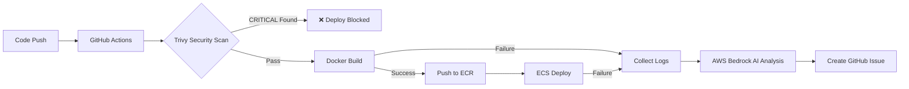

# 🛡️ DevSecOps 파이프라인 구축 및 트러블슈팅 보고서

## 1. 개요 (Overview)

본 프로젝트는 GitHub Actions 기반의 CI/CD 파이프라인에 **보안 취약점 스캔(Trivy)**과 **AI 기반 장애 분석(AWS Bedrock)**을 통합하여, 배포 안정성을 높이고 보안 위협을 사전에 차단하는 DevSecOps 환경을 구축했습니다.

### 주요 기능

- 코드 푸시 시 Trivy가 소스코드 및 의존성 패키지의 보안 취약점(CVE)을 스캔
- CRITICAL/HIGH 등급의 취약점 발견 시 배포 자동 차단
- 빌드/배포 실패 시, 로그를 수집하여 **AWS Bedrock (Claude 3 Haiku)**이 원인을 분석하고 한글 리포트를 GitHub Issue로 등록

### Trivy 보안 스캔 결과


_배포 차단: CRITICAL 취약점 발견 시 자동 중단_


_Backend 보안 스캔 상세 결과_

---

## 2. 주요 트러블슈팅 및 해결 과정 (Troubleshooting Log)

### 🔴 Issue 1: Backend 보안 취약점 및 호환성 충돌

**상황 (Situation)**  
Trivy 스캔 결과, Django 5.2 버전에서 SQL Injection (CVE-2025-64459, Critical) 취약점이 발견됨. 또한 초기 Docker 환경(python:3.9)과 최신 Django 버전 간의 호환성 문제가 발생함.

**원인 (Root Cause)**

- Django 5.0 이상 버전은 Python 3.10 이상을 요구함 (기존 환경은 3.9)
- 현재 사용 중인 Django 버전에 심각한 보안 결함 존재

**해결 (Action)**

1. **런타임 업그레이드**: Dockerfile의 베이스 이미지를 `python:3.10-slim`으로 업그레이드
2. **버전 제약 설정**: requirements.txt를 수정하여 보안 패치가 적용된 안전한 버전(5.1.14)을 사용하되, 메이저 버전 변경으로 인한 충돌을 방지하기 위해 상한선을 설정

```python
Django>=5.1.14,<5.2
```

**결과 (Result)**  
✅ 보안 취약점 제거 완료 및 Python 3.10 환경에서의 안정적인 빌드 성공

---

### 🔴 Issue 2: Frontend 빌드 실패 (Next.js 15 & Turbopack)

**상황 (Situation)**  
Frontend 빌드(`yarn build`) 과정에서 두 가지 에러가 연쇄적으로 발생:

1. `yarn install` 실패 (Node 버전 불일치)
2. `Parsing CSS source code failed` 에러 발생

**원인 (Root Cause)**

- **Node.js 버전**: Next.js 15는 Node.js 18.17+ 이상을 요구하나, Docker 이미지는 구버전이었음
- **CSS 문법 엄격화**: Next.js 15의 새로운 빌드 도구(Turbopack)가 CSS 표준을 엄격하게 검사함. 기존 코드에 있던 `:not(...)::-webkit-scrollbar-thumb::before`는 CSS 표준상 유효하지 않은 가상 요소 중첩 사용이었음

**해결 (Action)**

1. **Node.js 업그레이드**: front/Dockerfile을 `node:20-alpine`으로 변경
2. **의존성 최신화**: react, react-dom을 19 버전(RC) 호환 버전으로 업그레이드
3. **CSS Refactoring**: globals.css에서 표준에 어긋나는 `::before` 가상 요소를 제거하고 스타일을 thumb 요소에 직접 적용

```css
/* 제거됨 - Turbopack 파싱 오류 */
/* :not(.no-custom-scrollbar)::-webkit-scrollbar-thumb::before */

/* 주석으로 표시하여 향후 참고용으로 보존 */
```

**결과 (Result)**  
✅ Next.js 15 환경에서 빌드 정상화 및 최신 React 기능 활용 기반 마련

---

### 🔴 Issue 3: AI 분석 서비스 연동 실패 (AWS Bedrock Region)

**상황 (Situation)**  
배포 실패 원인을 분석하기 위해 AWS Bedrock을 호출했으나, `ValidationException: ... with on-demand throughput isn't supported` 에러가 발생하며 호출 실패.

**원인 (Root Cause)**

- **추론 프로파일 정책**: 최신 모델(Claude 3.5 Sonnet v2)은 서울 리전 등 일부 리전에서 "원본 모델 ID(Raw ID)"를 통한 직접 호출(On-Demand)을 제한하고, "시스템 추론 프로파일" 사용을 강제함
- GitHub Actions 스크립트에서 이를 고려하지 않고 원본 ID를 사용하여 차단됨

**해결 (Action)**  
**모델 변경 (Optimization)**: 로그 분석과 같이 속도가 중요하고 비용 효율적인 작업에 적합하며, 서울 리전(`ap-northeast-2`)에서 제약 없이 즉시 호출 가능한 Claude 3 Haiku 모델로 변경

```python
modelId='anthropic.claude-3-haiku-20240307-v1:0'
```

**결과 (Result)**  
✅ 안정적으로 AI 분석 기능을 연동하여, 배포 실패 시 즉각적인 원인 분석 리포트를 제공받음

---

### 🔴 Issue 4: "배포 전 실패" 시 로그 누락 문제

**상황 (Situation)**  
빌드 단계나 Trivy 스캔 단계에서 실패할 경우, ECS 컨테이너가 생성되지 않아 CloudWatch 로그가 없음. 이로 인해 AI가 "원인 불명(Unknown)"이라고 진단함.

**원인 (Root Cause)**  
AI 분석 스크립트가 "실행 중인 서버 로그(Runtime Logs)"만 조회하도록 설계되어 있어, "빌드 타임 로그"를 참조하지 못함.

**해결 (Action)**

1. **로그 파이프라인 개선**: GitHub Actions의 `run` 단계에서 발생하는 표준 출력(stdout)과 에러(stderr)를 파일로 리다이렉션(`> log.txt 2>&1`)하여 저장
2. **AI 프롬프트 확장**: Python 스크립트가 저장된 Build Log와 Trivy Security Log 파일까지 읽어서 Bedrock에게 전달하도록 로직 수정

**결과 (Result)**  
✅ 빌드 에러, 보안 위규, 런타임 에러 등 모든 단계의 실패 원인을 AI가 정확하게 분석 가능해짐

---

## 3. 기술적 성과 (Achievements)

### 🎯 Shift-Left Security 실현

배포 후에 보안 문제를 발견하는 것이 아니라, 코드 푸시 단계에서 Trivy를 통해 Critical 이슈를 **0건**으로 유지하는 프로세스 확립.

### ⚡ Mean Time To Resolution (MTTR) 단축

배포 실패 시 엔지니어가 로그를 찾아 헤매는 시간을 줄이고, AI가 요약해 준 한글 리포트를 통해 즉시 원인 파악 및 수정 가능.

### 🚀 최신 기술 스택 확보

호환성 문제를 해결하며 다음 환경으로 업그레이드 완료:

- **Backend**: Django 5.1 + Python 3.10
- **Frontend**: Next.js 15 + Node.js 20

---

## 4. 아키텍처 다이어그램



---

## 5. 보안 취약점 관리 프로세스

| 단계    | 도구           | 조치                       |
| ------- | -------------- | -------------------------- |
| 1. 스캔 | Trivy          | 코드 푸시 시 자동 실행     |
| 2. 분류 | Trivy          | CRITICAL/HIGH/MEDIUM/LOW   |
| 3. 차단 | GitHub Actions | CRITICAL 발견 시 배포 중단 |
| 4. 수정 | Manual + AI    | AI 분석 리포트 기반 패치   |
| 5. 검증 | Trivy Re-scan  | 취약점 제거 확인 후 배포   |

---

## 6. 참고 자료

- [Trivy 공식 문서](https://aquasecurity.github.io/trivy/)
- [AWS Bedrock 개발자 가이드](https://docs.aws.amazon.com/bedrock/)
- [Django 보안 릴리스 노트](https://www.djangoproject.com/weblog/)
- [Next.js 15 마이그레이션 가이드](https://nextjs.org/docs/upgrading)

---

**작성일**: 2026년 1월 18일  
**작성자**: DevSecOps Team  
**문서 버전**: 1.0
