# 🏗️ DeepSentinel Full Architecture

**AI-Powered CCTV Video Analysis Platform - Complete Infrastructure & CI/CD Architecture**

> Last Updated: February 9, 2026  
> AWS Region: ap-northeast-2 (Seoul)  
> Total Resources: 153 AWS Resources (Terraform Managed)

---

## 📐 Overall Architecture Diagram

<div align="center">
  
</div>

### 📖 Diagram Legend

**Connection Lines**

- 🟣 **Purple Line**: CI/CD & Automation Flow
- ⚫ **Black Line**: General Architecture
- 🔵 **Blue Line**: High-Volume Data Transfer
- ━━ **Solid**: Main Traffic / Provisioning
- ╌╌ **Dashed**: Control Signal / Status Check

**Special Symbols**

- 👆 **Manual Trigger / Approval**: "Click to Deploy" approval required
- 🧪 **Ephemeral Resource**: "Test be destroyed" temporary testing environment
- ⏰ **Scheduled Task**: Cron jobs-based scheduled tasks
- 🔄 **LifeCycle Policy**: Resource lifecycle management policy

---

This project consists of **CI/CD & IaC Pipeline** (left) and **AWS Cloud Infrastructure** (right), forming a fully automated architecture. Based on GitOps principles, we manage infrastructure as code and have built a pipeline integrating FinOps (cost optimization), DevSecOps (security automation), and actual resource testing (Terratest).

---

## ♾️ Part 1: CI/CD & IaC Pipeline

This project manages infrastructure changes as code (Terraform) based on **GitOps principles** and deploys through an automated pipeline. Cost prediction (FinOps), security scanning (DevSecOps), and actual resource testing (Terratest) are integrated into the pipeline.

### 1️⃣ Infra Governance Layer (Standardization)

**Policy-as-Code validation before infrastructure deployment**

**🤖 GitHub Actions Workflows:**

```
PR on terraform/** branch
    ↓
[Infracost] → Calculate cost impact → PR comment 💰
    ↓
[Terraform CI] → terraform plan → AI Analysis 🤖
    ↓
[Tfsec] → Security policy check 🛡️
    ↓
[Checkov] → Cloud best practices validation 🛡️
    ↓
PR Review & Approval ✅
```

**👨‍💻 Manual Operations (Not in GitHub Actions):**

```
Developer Workstation
    ↓
Terraform Modules (6 modules: network, storage, security, compute, pipeline, iam)
    ↓
terraform apply (Manual execution by developer)
    ↓
S3 Backend + DynamoDB Lock (State management)
    ↓
AWS Resources Provisioned
```

**GitHub Actions Components:**

| Tool         | Role                                     | Trigger                | Automation |
| ------------ | ---------------------------------------- | ---------------------- | ---------- |
| Infracost    | Calculate cost impact ($) → PR comment   | terraform/\*\* changes | ✅ Auto    |
| Terraform CI | Execute `terraform plan` + AI analysis   | terraform/\*\* PR      | ✅ Auto    |
| Tfsec        | Security policy violation checks         | terraform/\*\* PR      | ✅ Auto    |
| Checkov      | Cloud security best practices validation | terraform/\*\* PR      | ✅ Auto    |
| AWS Bedrock  | Claude analyzes plan results (Korean)    | After plan completes   | ✅ Auto    |

**Manual Components (Developer-driven):**

| Tool              | Role                                                  | Execution         |
| ----------------- | ----------------------------------------------------- | ----------------- |
| Terraform Modules | 6 reusable modules (network, storage, security, etc.) | Developer applies |
| S3 Backend        | Centralized terraform.tfstate storage                 | terraform init    |
| DynamoDB Lock     | Concurrency control (prevent state conflicts)         | terraform apply   |

**FinOps Automation:**

- Infracost calculates monthly cost impact of changes
- Auto-posts to PR comments (e.g., "+$45.60 (+32%)")
- Provides resource-level cost breakdown (ECS, RDS, NAT Gateway, etc.)

**AI-Powered Plan Analysis:**

```yaml
Workflow (GitHub Actions):
  1. Execute terraform plan
  2. Extract plan results as JSON
  3. Send to AWS Bedrock Claude
  4. AI analyzes in Korean:
     - Change summary
     - Potential risks
     - Cost impact
     - Recommendations
  5. Auto-create GitHub Issue
```

**Developer Workflow:**

```yaml
Final Deployment (Manual):
  1. Review PR analysis (Infracost, Terraform CI, Security)
  2. Merge PR after approval
  3. Developer executes: terraform apply
  4. Confirm resource provisioning
```

---

### 2️⃣ Build & Validation Layer (Artifacts)

**Immutable Infrastructure artifact build and deployment**

**🤖 GitHub Actions Pipeline:**

```
Push to main branch
    ↓
[Trivy Security Scan] → Container + Filesystem vulnerability check 🛡️
    ↓
[Docker Build] → Build 3 container images (frontend, backend, batch)
    ↓
[ECR Push] → Push images to AWS ECR
    ↓
[ECS Deploy] → Rolling Update (Zero Downtime)
```

**👨‍💻 Separate Automation (Not GitHub Actions):**

```
Developer Workstation
    ↓
[Packer] → Build GPU Worker Golden AMI
    ↓
Pre-install: CUDA 11.8, PyTorch 2.0, YOLOv8, MiVOLO, MEBOW, LLaVA
    ↓
Published to AWS AMI (ap-northeast-2)
    ↓
Used by AWS Batch GPU instances
```

**GitHub Actions Components:**

| Tool   | Role                                              | Trigger      | Automation |
| ------ | ------------------------------------------------- | ------------ | ---------- |
| Trivy  | CRITICAL/HIGH vulnerability check (block deploy)  | Push to main | ✅ Auto    |
| Docker | Build container images (frontend, backend, batch) | Push to main | ✅ Auto    |
| ECR    | Push images to container registry                 | Push to main | ✅ Auto    |
| ECS    | Fargate Service deployment (Rolling Update)       | Push to main | ✅ Auto    |

**Manual Components:**

| Tool   | Role                                           | Execution      |
| ------ | ---------------------------------------------- | -------------- |
| Packer | GPU Worker AMI build (AI models pre-installed) | Developer runs |

**Trivy Security Scanning (GitHub Actions):**

```yaml
Steps:
  1. After Docker Build completes
  2. Scan image with Trivy
  3. If CRITICAL/HIGH found:
     → Block deployment ⛔
     → Collect CloudWatch Logs
     → Bedrock AI analysis
     → Auto-create GitHub Issue
  4. If passed → Continue to ECR Push
```

**Custom AMI Build (Packer - Manual):**

```hcl
# Golden image for EC2 Batch Worker
# Developer executes: packer build aws-gpu-ami.pkr.hcl

- Base: Deep Learning AMI (Ubuntu 20.04)
- Pre-installed:
  - CUDA 11.8
  - PyTorch 2.0
  - YOLOv8 + MiVOLO + MEBOW + LLaVA
  - FFmpeg
- Result: Cold Start 20min → 3min (AI model pre-loaded)
- Usage: AWS Batch references this AMI for GPU instances
```

---

### 3️⃣ Infrastructure Testing Layer (Validation)

**Three-tier testing strategy: Automatic syntax check + Manual resource validation**

**Mode 1: Automatic Syntax Testing (Every PR)**

```
🤖 GitHub Actions (terraform/** PR)
    ↓
[terraform fmt] → Code formatting check
    ↓
[terraform validate] → Configuration validation
    ↓
[tflint] → Linting rules check
    ↓
✅ Pass → Allow PR merge
❌ Fail → Block PR merge
```

**Mode 2: Manual Module Testing ($0.5 per module)**

```
👨‍💻 Developer triggers (Manual approval required)
    ↓
[Terratest + Go] → Test individual module
    ↓
Options:
  - network module only
  - storage module only
  - security module only
    ↓
[Provision in AWS] → Create actual resources in region
    ↓
[Validate] → Run Go test assertions
    ↓
[Destroy] → Immediately delete all test resources 💰
```

**Mode 3: Manual Integration Testing ($2.0)**

```
👨‍💻 Developer triggers (Manual approval required)
    ↓
[Terratest + Go] → Test entire infrastructure
    ↓
[Provision ALL modules] → network + storage + security + compute + pipeline
    ↓
[Validate Integration] → Test cross-module interactions
    ↓
[Destroy] → Immediately delete all test resources 💰
```

**Testing Strategy Summary:**

| Mode                | Tool                  | Cost  | Trigger   | Scope                                           |
| ------------------- | --------------------- | ----- | --------- | ----------------------------------------------- |
| 1. Syntax Check     | fmt, validate, tflint | $0    | ✅ Auto   | Code quality (every PR)                         |
| 2. Module Testing   | Terratest (Go)        | ~$0.5 | 👆 Manual | Individual modules (network, storage, security) |
| 3. Integration Test | Terratest (Go)        | ~$2.0 | 👆 Manual | Full infrastructure (all modules)               |

**Ephemeral Testing Features:**

- ✅ Create **actual AWS resources** in real region (not mocked)
- ✅ **Immediately destroy** after validation (prevent cost accumulation)
- ✅ Isolated test environment per execution
- ✅ **Manual approval** for cost control ($0.5 or $2.0)

**Terratest Example (Go):**

```go
// Mode 2: Individual module test (network)
func TestNetworkModule(t *testing.T) {
    terraformOptions := &terraform.Options{
        TerraformDir: "../modules/network",
        Vars: map[string]interface{}{
            "environment": "test",
        },
    }

    // Provision actual VPC in AWS
    terraform.InitAndApply(t, terraformOptions)

    // Validate VPC exists
    vpcID := terraform.Output(t, terraformOptions, "vpc_id")
    assert.NotEmpty(t, vpcID)

    // Immediately destroy after test
    defer terraform.Destroy(t, terraformOptions)
}

// Mode 3: Full integration test (all modules)
func TestFullInfrastructure(t *testing.T) {
    terraformOptions := &terraform.Options{
        TerraformDir: "../",
        Vars: map[string]interface{}{
            "environment": "integration-test",
        },
    }

    // Provision ALL resources (network + storage + security + compute + pipeline)
    terraform.InitAndApply(t, terraformOptions)

    // Validate cross-module integration
    vpcID := terraform.Output(t, terraformOptions, "vpc_id")
    rdsEndpoint := terraform.Output(t, terraformOptions, "db_host")
    assert.NotEmpty(t, vpcID)
    assert.NotEmpty(t, rdsEndpoint)

    // Immediately destroy all test resources ($2.0 worth)
    defer terraform.Destroy(t, terraformOptions)
}
```

---

### 4️⃣ Ops & Lifecycle Layer (Maintenance)

**Independent operational automation tasks (not sequential pipeline)**

**🤖 GitHub Actions - Batch Monitor**

```
AWS Batch Job FAILED
    ↓
[CloudWatch Event] → Trigger GitHub Actions
    ↓
[Collect Logs] → Fetch CloudWatch Logs for failed job
    ↓
[Create GitHub Issue] → Auto-create issue with error details 🔔
```

**🤖 GitHub Actions - ECR Cleanup (Cost Savings)**

```
Cron Schedule (Weekly Sunday)
    ↓
[Scan ECR Repositories] → Find images older than 30 days
    ↓
[Delete Old Images] → Prune unused images 💰
    ↓
Result: Storage cost reduction
```

**🤖 GitHub Actions - Scheduled Ops (Cost Savings)**

```
Cron Schedule
    ↓
Daily 20:00 KST → [ECS Update] → Set desired_count = 0 (Stop dev cluster) 💰
Daily 09:00 KST → [ECS Update] → Set desired_count = 1 (Start dev cluster)
```

**👨‍💻 Manual Scripts - AWS CLI (Not GitHub Actions)**

```
Developer Workstation
    ↓
[AWS CLI Scripts] → Deploy video-analysis Docker image
    ↓
Update Batch Job Definition with new image
    ↓
AWS Batch uses updated image for GPU processing
```

**Summary Table:**

| Task            | Type           | Schedule/Trigger         | Purpose                              | Automation |
| --------------- | -------------- | ------------------------ | ------------------------------------ | ---------- |
| Batch Monitor   | GitHub Actions | On Batch job FAILED      | Create GitHub Issue with error logs  | ✅ Auto    |
| ECR Cleanup     | GitHub Actions | Cron (Weekly Sun)        | Delete images >30d (cost savings)    | ✅ Auto    |
| Scheduled Ops   | GitHub Actions | Cron (Daily 20:00/09:00) | ECS desired_count=0/1 (cost savings) | ✅ Auto    |
| AWS CLI Scripts | Manual Script  | Developer executes       | Deploy video-analysis Docker image   | 👨‍💻 Manual  |

**Batch Job Monitor (GitHub Actions):**

```yaml
Trigger: AWS Batch Job Status = FAILED
Steps:
  1. CloudWatch Event detects FAILED job
  2. Trigger GitHub Actions workflow
  3. Fetch job logs from CloudWatch Logs
  4. Parse error messages
  5. Auto-create GitHub Issue:
     - Title: "Batch Job Failed: [job_id]"
     - Body: Error logs, job details, timestamp
     - Labels: bug, aws-batch
```

**ECR Cleanup (GitHub Actions):**

```yaml
Schedule: cron(0 0 * * 0)  # Every Sunday midnight
Steps:
  1. List all ECR repositories
  2. For each repository:
     - Query images older than 30 days
     - Delete old images
  3. Calculate storage savings
  4. Optional: Post summary to Slack

Example Script:
#!/bin/bash
aws ecr describe-images \
  --repository-name backend \
  --query 'imageDetails[?imagePushedAt<=`2026-01-10`]' \
  | jq -r '.[].imageDigest' \
  | xargs -I {} aws ecr batch-delete-image \
    --repository-name backend \
    --image-ids imageDigest={}
```

**Scheduled Ops - ECS Cost Savings (GitHub Actions):**

```yaml
Daily Schedule:
  - cron(0 11 * * ?) # 20:00 KST → Stop dev cluster
  - cron(0 0 * * ?) # 09:00 KST → Start dev cluster

Steps (Stop): 1. aws ecs update-service \
  --cluster dev-cluster \
  --service frontend \
  --desired-count 0
  2. aws ecs update-service \
  --cluster dev-cluster \
  --service backend \
  --desired-count 0

Steps (Start): 1. aws ecs update-service \
  --cluster dev-cluster \
  --service frontend \
  --desired-count 1
  2. aws ecs update-service \
  --cluster dev-cluster \
  --service backend \
  --desired-count 1

Result: ~13 hours of cost savings per day (20:00-09:00)
```

**AWS CLI Scripts (Manual - Not GitHub Actions):**

```bash
# Developer executes this script manually
# Purpose: Update Batch Job Definition with new video-analysis image

#!/bin/bash
# File: scripts/update-batch-job-definition.sh

# 1. Build new video-analysis image
docker build -t video-analysis:latest ./video-analysis

# 2. Tag and push to ECR
aws ecr get-login-password --region ap-northeast-2 | docker login --username AWS --password-stdin
docker tag video-analysis:latest ${ECR_REPO}/video-analysis:latest
docker push ${ECR_REPO}/video-analysis:latest

# 3. Update Batch Job Definition
aws batch register-job-definition \
  --job-definition-name video-analysis-gpu \
  --type container \
  --container-properties file://job-definition.json

echo "✅ Batch Job Definition updated with new video-analysis image"
```

---

## 🌐 Part 2: AWS Cloud Infrastructure

### 1️⃣ Network Architecture

**VPC Configuration (10.0.0.0/16)**

```
VPC
├── Public Subnet (Multi-AZ: 2a, 2c)
│   ├── Application Load Balancer
│   ├── ECS Fargate Cluster (Frontend + Backend)
│   ├── AWS Batch Compute Environment
│   └── NAT Gateway (for external API calls)
│
├── Private Subnet (Multi-AZ: 2a, 2c)
│   └── RDS PostgreSQL 16 + pgvector
│
├── Internet Gateway (external communication)
└── S3 Gateway Endpoint (S3 access, free)
```

**Network Layer Components:**

| Resource            | Count | Purpose                                    |
| ------------------- | ----- | ------------------------------------------ |
| VPC                 | 1     | Isolated network environment (10.0.0.0/16) |
| Public Subnet       | 2     | Multi-AZ (ap-northeast-2a, 2c)             |
| Private Subnet      | 2     | Multi-AZ (RDS only)                        |
| Internet Gateway    | 1     | Public Subnet external communication       |
| NAT Gateway         | 1     | Private → Public outbound traffic          |
| S3 Gateway Endpoint | 1     | S3 access cost savings (free)              |
| Security Groups     | 4     | ALB, ECS Tasks, Batch, RDS                 |

**Security Design:**

- **ALB Security Group**: Internet → 443/80 ports only
- **ECS Tasks Security Group**: ALB → 3000/8000 ports only
- **RDS Security Group**: ECS/Batch → 5432 port only
- **Batch Security Group**: VPC internal communication only

---

### 2️⃣ Compute Layer

**ECS Fargate Cluster**

| Service  | Spec           | Auto Scaling | Usage                 |
| -------- | -------------- | ------------ | --------------------- |
| Frontend | 0.5 vCPU + 1GB | 1-3 tasks    | Next.js 15 App Router |
| Backend  | 1 vCPU + 2GB   | 1-3 tasks    | Django 5.2 REST API   |

**Auto Scaling Policy:**

- **Target Metric**: CPU utilization 70% threshold
- **Scale-Out**: Start new task within 1 minute
- **Scale-In**: Terminate task after 5 minute grace period

**AWS Batch (GPU Compute)**

| Item          | Specification                               |
| ------------- | ------------------------------------------- |
| Instance Type | g5.xlarge (NVIDIA A10G Tensor 24GB)         |
| Auto Scaling  | 0-4 instances (Queue depth based)           |
| AMI           | Custom-built (Packer) + AI model pre-loaded |
| Cold Start    | ~3 minutes (AMI optimized)                  |
| Job Queue     | Priority 10                                 |

---

### 3️⃣ Storage Layer

**S3 Buckets (5 buckets)**

| Bucket          | Purpose                                   | Lifecycle Policy      |
| --------------- | ----------------------------------------- | --------------------- |
| raw-videos      | Original video upload (Presigned URL)     | Glacier after 30 days |
| thumbnails      | Video thumbnail images                    | Retain 90 days        |
| highlights      | Key event frames (AI analysis results)    | Permanent retention   |
| terraform-state | Terraform State management (Backend)      | Versioning enabled    |
| analysis-models | AI model checkpoints (YOLO, MiVOLO, etc.) | Permanent retention   |

**RDS PostgreSQL 16**

| Item          | Specification                       |
| ------------- | ----------------------------------- |
| Instance Type | db.t3.micro (2 vCPU, 1GB RAM)       |
| Storage       | 20GB gp3 (Auto Scaling → max 100GB) |
| Extensions    | pgvector (Vector Search)            |
| Multi-AZ      | Standby disabled (cost savings)     |
| Backup        | Automatic backup 7 days retention   |

**Secrets Manager (2 secrets)**

- `db_password`: RDS master password
- `django_secret_key`: Django SECRET_KEY

---

### 4️⃣ Data Processing Pipeline

**Serverless GPU Video Analysis Pipeline**

```mermaid
graph LR
    User["👤 User"] --> Frontend["Frontend<br/>(Next.js)"]
    Frontend --> Backend["Backend<br/>(Django)"]
    Backend --> S3Raw["S3<br/>raw-videos"]
    S3Raw --> SQS["SQS Queue<br/>+ DLQ"]
    SQS --> Lambda["Lambda<br/>sqs-to-batch"]
    Lambda --> Batch["AWS Batch<br/>(GPU g5.xlarge)"]
    Batch --> RDS["PostgreSQL<br/>+ pgvector"]
    Batch --> S3High["S3<br/>highlights"]
    Backend --> Bedrock["AWS Bedrock<br/>(Claude + Titan)"]

    style User fill:#e1f5ff
    style S3Raw fill:#fff9c4
    style S3High fill:#fff9c4
    style Batch fill:#ffebee
    style RDS fill:#e8f5e9
    style Bedrock fill:#f3e5f5
```



**Pipeline Components:**

| Resource             | Count | Purpose                                  |
| -------------------- | ----- | ---------------------------------------- |
| SQS Queue            | 1     | Async job message delivery               |
| DLQ (Dead Letter)    | 1     | Failed message isolation (reprocessing)  |
| Lambda Function      | 1     | SQS → Batch auto trigger + deduplication |
| Batch Job Definition | 2     | GPU job definition (Video Analysis)      |
| CloudWatch Alarms    | 2     | DLQ messages, Queue Depth monitoring     |

---

### 5️⃣ End-to-End User Flow (23 Steps)

**📹 Complete Video Upload & Analysis Flow**


**Phase Details:**

**Phase 1: Video Upload (Steps 1-4)**

1. User uploads video request
2. Backend generates S3 Presigned URL (via Gateway Endpoint, cost savings)
3. Save video metadata to RDS (video_id, filename, size, upload time)
4. Django creates thumbnail and saves to S3

**Phase 2: GPU Processing (Steps 5-15)** 5. Backend publishes job message to SQS 6. Lambda auto-detects SQS event 7. Lambda submits job to Batch (includes deduplication check) 8. Fetch jobs from Batch Job Queue 9. Provision EC2 g5.xlarge instance (Auto Scaling) 10. Restore EBS volume from AMI (AI models pre-installed) 11. Mount EBS volume to Container 12. Pull latest container image from ECR 13. Download video from S3 14. Save AI analysis results to PostgreSQL (pgvector) 15. Save key event frames to S3 highlights

**Phase 3: RAG-based Q&A (Steps 16-23)** 16. Generate video summary with Bedrock Claude 17. User inputs natural language question 18. Generate Text2SQL query with Bedrock Claude 19. Generate Vector Embedding with Bedrock Titan 20. Execute SQL + Vector Search on PostgreSQL 21. Extract top 5 results with Bedrock Reranker (30→5) 22. Generate final answer with Bedrock Claude 23. Save session data (conversation history)

---

### 6️⃣ Global Services (Outside VPC)

**AWS Managed Services**

| Service         | Model/Function                   | Purpose                          |
| --------------- | -------------------------------- | -------------------------------- |
| AWS Bedrock     | Claude 3 Haiku                   | Video Summary, Q&A, Text2SQL     |
|                 | Titan Embeddings G1              | Vector Embedding generation      |
|                 | Cohere Rerank v3                 | Search result reranking          |
| Secrets Manager | -                                | DB Password, Django Secret       |
| CloudWatch      | Logs + Metrics                   | Centralized logging & monitoring |
| Route53         | Hosted Zone (deepsentinel.cloud) | DNS management                   |
| ACM             | SSL/TLS Certificate              | HTTPS encryption                 |

---

## 📊 Infrastructure Summary

### **Total: 153 AWS Resources**

| Layer          | Resources | Key Components                                                               |
| -------------- | --------- | ---------------------------------------------------------------------------- |
| Network        | 30        | VPC, Subnet, IGW, NAT, Route Tables, Security Groups, ALB, Route53, ACM      |
| Compute        | 35        | ECS Cluster, Fargate Services, Auto Scaling, AWS Batch, ECR, CloudWatch Logs |
| Storage        | 25        | 5x S3 Buckets, RDS PostgreSQL, Secrets Manager                               |
| Pipeline       | 40        | SQS, Lambda, Batch Job Definitions, CloudWatch Alarms                        |
| Security (IAM) | 15        | ECS Roles, Batch Roles, Lambda Role, Instance Profiles                       |
| IAM Users      | 8         | Admin/Developer Groups, 3 Users, CI/CD User                                  |

---

## 🎯 Key Architectural Decisions

### **1. Terraform Modular Architecture**

**Rationale**: Maintainability, reusability, team collaboration

**Structure**:

```
terraform/
├── modules/
│   ├── network/      # VPC, Subnet, ALB, Route53
│   ├── storage/      # S3, RDS, Secrets Manager
│   ├── security/     # IAM Roles, Policies
│   ├── compute/      # ECS, ECR
│   ├── pipeline/     # Batch, Lambda, SQS
│   └── iam/          # Users, Groups
└── main.tf          # Module integration
```

**Migration**: Zero-downtime transition with 200+ `moved` blocks

---

### **2. DevSecOps Pipeline**

**Shift-Left Security**:

- Trivy build-stage scan (block before deployment)
- Tfsec/Checkov code-level scan
- Block deployment when CRITICAL/HIGH vulnerabilities found

**AI-Powered Ops**:

- Bedrock analyzes Terraform Plan
- AI diagnosis of CloudWatch Logs on deployment failure
- Auto-create GitHub Issues (Korean)

**FinOps Automation**:

- Infracost PR integration (pre-predict cost impact)
- Utilize monthly 10k free tier requests

---

### **3. Serverless GPU Architecture**

**AWS Batch + Custom AMI**:

- Usage-based billing (On-Demand)
- Auto Scaling 0-4 instances
- Cold Start optimization: 20min → 3min (AI model pre-installation)

**Cost Model**:

```
Process 100 videos per month:
- GPU time: 100 × 15min × $1.006/hour = $25.15
- Total cost: ~$70/month

vs 24/7 GPU Server: $723/month
→ 90% cost savings ✅
```

---

### **4. RAG-based Intelligent Search**

**PostgreSQL + pgvector**:

- Vector Search (Titan Embeddings)
- SQL Query (Text2SQL by Claude)
- Merge Hybrid Search results

**Bedrock Multi-Model Utilization**:

1. Titan Embeddings → Generate vectors
2. Claude Haiku → Text2SQL + Summarization
3. Cohere Rerank → Extract top 5 (30→5)

---

## 📚 Related Documentation

### **Infrastructure**

- [Terraform Modules](../terraform/README.md) - Detailed module explanations
- [Terraform Refactoring Guide](02_infrastructure/TERRAFORM_REFACTORING.md) - Zero-downtime migration
- [Cost Optimization](04_cost_optimization/COST_REDUCTION_JAN_2026.md) - Cost reduction strategy

### **CI/CD & DevOps**

- [GitHub Actions CI/CD](05_devops/GITHUB_ACTIONS_TERRAFORM_CI_2026-01-16.md) - Terraform CI implementation
- [DevSecOps Pipeline](05_devops/DEVSECOPS_PIPELINE_IMPLEMENTATION.md) - Trivy + Bedrock integration
- [GitHub Actions Cost Optimization](04_cost_optimization/GITHUB_ACTIONS_COST_OPTIMIZATION.md) - Infracost setup

### **Application**

- [Backend API](../back/README.md) - Django + pgvector RAG
- [Frontend](../front/README.md) - Next.js 15 App Router
- [Video Analysis](../video-analysis/README.md) - Multi-AI Pipeline
- [AWS Batch Worker](../batch/README.md) - GPU Processing

### **Overview**

- [Service Flow Demo](../FLOW.md) - User workflow
- [Infrastructure Overview](../INFRA.md) - Infrastructure overview

---

**Last Updated**: February 9, 2026  
**Maintained by**: DeepSentinel Team
