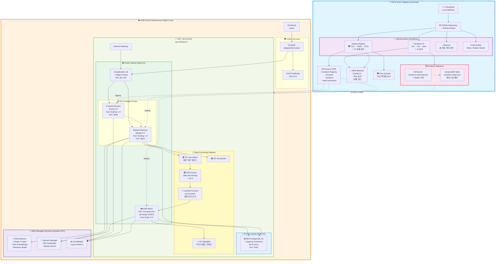
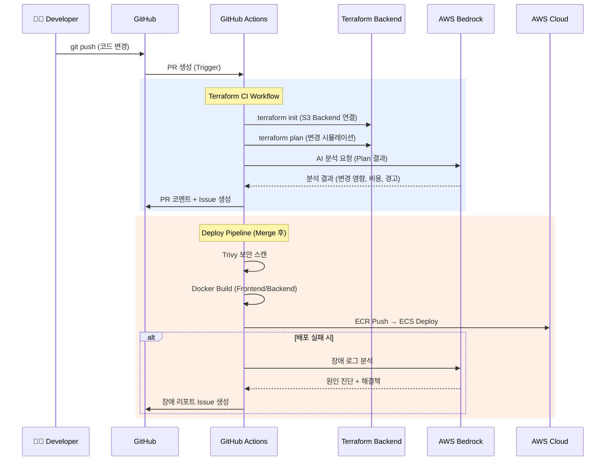
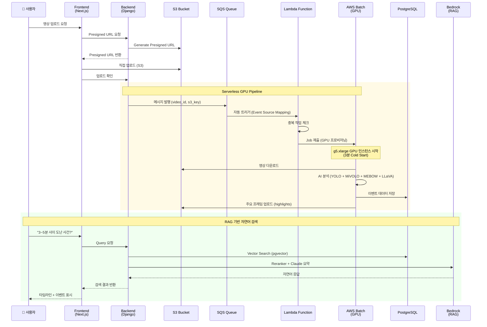
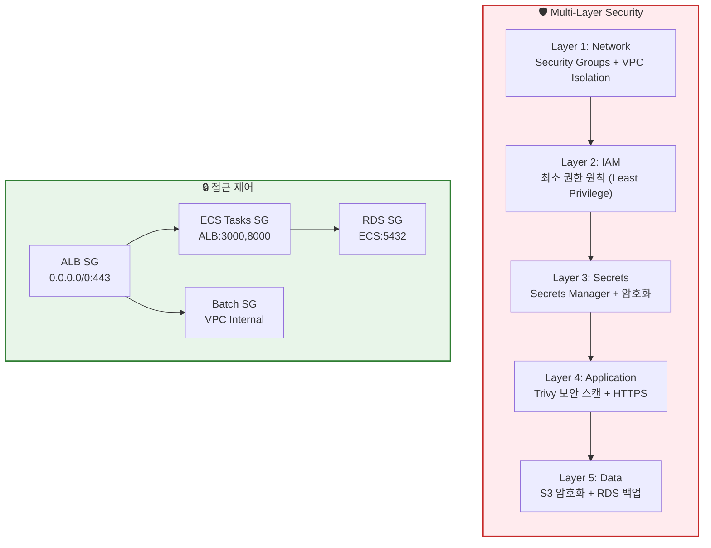
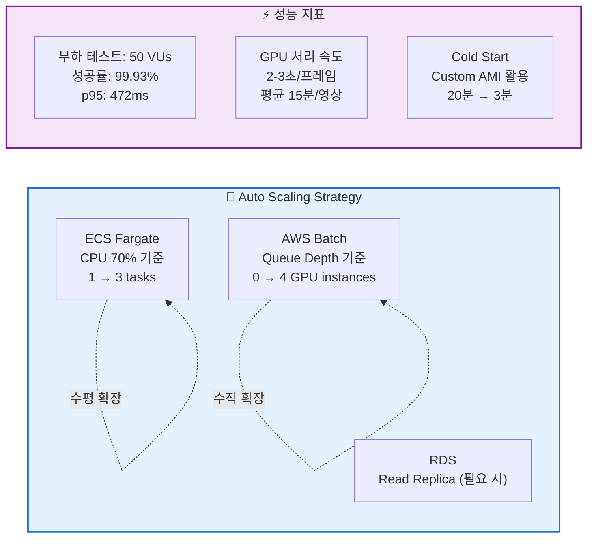

# 🏗️ DeepSentinel Cloud Architecture

**AI-Powered CCTV Video Analysis Platform - Complete Infrastructure Diagram**

> 작성일: 2026년 1월 26일  
> AWS Region: ap-northeast-2 (Seoul)  
> Total Resources: 153 AWS Resources (Terraform Managed)

---

## 📐 Overall Architecture



---

## 🔄 Complete Data Flow

### 1️⃣ **개발 & 배포 플로우** (CI/CD)



### 2️⃣ **영상 분석 플로우** (Video Processing)



---

## 📊 Infrastructure Components Breakdown

### **Network Layer** (30 Resources)

| 리소스           | 수량                | 용도                           |
| ---------------- | ------------------- | ------------------------------ |
| VPC              | 1                   | 격리된 네트워크 환경           |
| Public Subnet    | 2                   | Multi-AZ (ap-northeast-2a, 2c) |
| Private Subnet   | 2                   | Multi-AZ (RDS 배치)            |
| Internet Gateway | 1                   | 외부 통신                      |
| Route Tables     | 2 + 4 associations  | Public/Private 라우팅          |
| Security Groups  | 4                   | ALB, ECS, Batch, RDS           |
| ALB              | 1 + 2 Target Groups | 로드밸런싱                     |
| Listeners        | 2                   | HTTP (80), HTTPS (443)         |
| Route53          | 1 Zone + 3 Records  | DNS 관리                       |
| ACM Certificate  | 1 + Validation      | SSL/TLS                        |

### **Compute Layer** (35 Resources)

| 리소스                | 수량 | 스펙                          | 용도                     |
| --------------------- | ---- | ----------------------------- | ------------------------ |
| ECS Cluster           | 1    | -                             | 컨테이너 오케스트레이션  |
| ECS Fargate Services  | 2    | 0.5 vCPU + 1GB / 1 vCPU + 2GB | Frontend, Backend        |
| Auto Scaling          | 4    | Target + Policy               | CPU 기반 (1-3 tasks)     |
| ECR Repositories      | 3    | -                             | frontend, backend, batch |
| AWS Batch Compute Env | 1    | g5.xlarge (0-4 instances)     | GPU 영상 분석            |
| Batch Job Queue       | 1    | Priority: 10                  | 작업 대기열              |
| CloudWatch Log Groups | 5    | -                             | 로그 수집                |

### **Storage Layer** (25 Resources)

| 리소스          | 수량 | 크기               | 용도                                                                |
| --------------- | ---- | ------------------ | ------------------------------------------------------------------- |
| S3 Buckets      | 5    | -                  | raw-videos, thumbnails, highlights, terraform-state, analysis-model |
| Bucket Policies | 5    | -                  | IAM 기반 접근 제어                                                  |
| RDS PostgreSQL  | 1    | db.t3.micro (20GB) | 메인 데이터베이스 + pgvector                                        |
| Secrets Manager | 2    | -                  | DB Password, Django Secret                                          |

### **Pipeline Layer** (40 Resources)

| 리소스               | 수량    | 용도                      |
| -------------------- | ------- | ------------------------- |
| SQS Queue            | 1 + DLQ | 비동기 메시지 처리        |
| Lambda Function      | 1       | SQS → Batch 트리거        |
| Batch Job Definition | 2       | GPU, CPU 작업 정의        |
| CloudWatch Alarms    | 2       | DLQ, Queue Depth 모니터링 |

### **Security Layer** (15 IAM Roles)

| 역할                    | 수량         | 용도                               |
| ----------------------- | ------------ | ---------------------------------- |
| ECS Task Execution/Role | 2 + Policies | 컨테이너 실행 권한                 |
| Batch Roles             | 5            | Service, Execution, Task, Instance |
| Lambda Role             | 1            | SQS 읽기 + Batch 제출              |
| Instance Profiles       | 2            | EC2 역할 연결                      |

### **IAM Users & Groups** (8 Resources)

| 유형            | 이름                                    | 권한                |
| --------------- | --------------------------------------- | ------------------- |
| Admin Group     | admins                                  | AdministratorAccess |
| Developer Group | developers                              | PowerUserAccess     |
| Users           | siheon_admin, seungbeom_dev, doyeon_dev | 그룹별 권한 상속    |
| CI/CD User      | github_actions                          | ECR + ECS Deploy    |

---

## 🔐 Security Architecture



---

## 💰 Cost Optimization Strategy

### **Before Optimization** (기존 아키텍처)

```
❌ NAT Gateway: $44.36/month
❌ VPC Endpoints: $29.34/month
❌ 24/7 GPU EC2: $723/month
────────────────────────────────
Total: ~$797/month
```

### **After Optimization** (현재 아키텍처)

```
✅ Public Subnet ECS: $0 (NAT 불필요)
✅ AWS Batch GPU (On-Demand): $1-3/video
✅ ECS Fargate: ~$30/month
✅ RDS t3.micro: ~$15/month
────────────────────────────────
Total: ~$45/month + 사용량 기반
💰 절감율: 94% (월 $752 절감)
```

### **Serverless GPU 비용 모델**

```
월 100개 영상 처리 기준:
- GPU 시간: 100 videos × 15min × $1.006/hour = $25.15
- 총 비용: $45 (고정) + $25 (변동) = $70/month

vs 24/7 GPU 서버: $723/month
→ 90% 비용 절감 ✅
```

---

## 📈 Scalability & Performance



---

## 🔄 CI/CD Pipeline Details

### **GitHub Actions Workflows**

#### 1. **Terraform CI** (terraform.yml)

```yaml
Trigger: Pull Request (terraform/**)
Steps: ✓ terraform fmt -check
  ✓ terraform init (S3 Backend)
  ✓ terraform plan
  ✓ AWS Bedrock AI 분석
  ✓ GitHub Issue 생성
  ✓ PR 코멘트 (Plan 결과)
```

#### 2. **Deploy Pipeline** (deploy.yml)

```yaml
Trigger: Push to main
Steps:
  ✓ Trivy Security Scan (CRITICAL/HIGH)
  ✓ Docker Build (Frontend + Backend)
  ✓ ECR Push
  ✓ ECS Deploy (Rolling Update)

  On Failure:
    → CloudWatch Logs 수집
    → Bedrock AI 장애 분석
    → GitHub Issue 자동 생성
```

#### 3. **Infracost** (infracost.yml)

```yaml
Trigger: PR on terraform/**
Steps: ✓ 현재 인프라 비용 계산
  ✓ 변경 후 예상 비용 계산
  ✓ Diff 결과 PR 코멘트
```

#### 4. **Batch Monitor** (batch-monitor.yml)

```yaml
Schedule: Daily 09:00 KST
Steps: ✓ AWS Batch 작업 상태 확인
  ✓ 실패 작업 로그 수집
  ✓ 비용 리포트 생성
  ✓ Slack 알림 (설정 시)
```

---

## 🎯 Key Architectural Decisions

### **1. Public Subnet ECS (NAT Gateway 제거)**

- **이유**: NAT Gateway 월 $44 절감
- **보안**: Security Group으로 인바운드 차단 (ALB만 허용)
- **Trade-off**: 외부 API 호출 시 공인 IP 노출 (현재 프로젝트에는 영향 없음)

### **2. AWS Batch GPU (24/7 EC2 대체)**

- **이유**: 사용량 기반 과금으로 90% 비용 절감
- **Cold Start 최적화**: Custom AMI (AI 모델 pre-load) → 20분 → 3분
- **Trade-off**: 즉시 처리 불가 (3분 대기), 허용 가능

### **3. Terraform Modular Architecture**

- **이유**: 유지보수성, 재사용성, 팀 협업
- **구조**: 6개 모듈 (network, storage, security, compute, pipeline, iam)
- **마이그레이션**: 200+ `moved` blocks으로 무중단 전환

### **4. DevSecOps Pipeline**

- **Shift-Left Security**: Trivy 빌드 단계 스캔 (배포 전 차단)
- **AI-Powered Ops**: Bedrock으로 장애 자동 진단
- **FinOps Automation**: Infracost PR 통합

---

## 📚 Related Documentation

- [Terraform Refactoring Guide](02_infrastructure/TERRAFORM_REFACTORING.md)
- [GitHub Actions CI/CD](05_devops/GITHUB_ACTIONS_TERRAFORM_CI_2026-01-16.md)
- [DevSecOps Pipeline](05_devops/DEVSECOPS_PIPELINE_IMPLEMENTATION.md)
- [Cost Optimization](04_cost_optimization/COST_REDUCTION_JAN_2026.md)
- [Infrastructure Overview](../INFRA.md)

---

**Last Updated**: 2026년 1월 26일  
**Maintained by**: DeepSentinel Team
